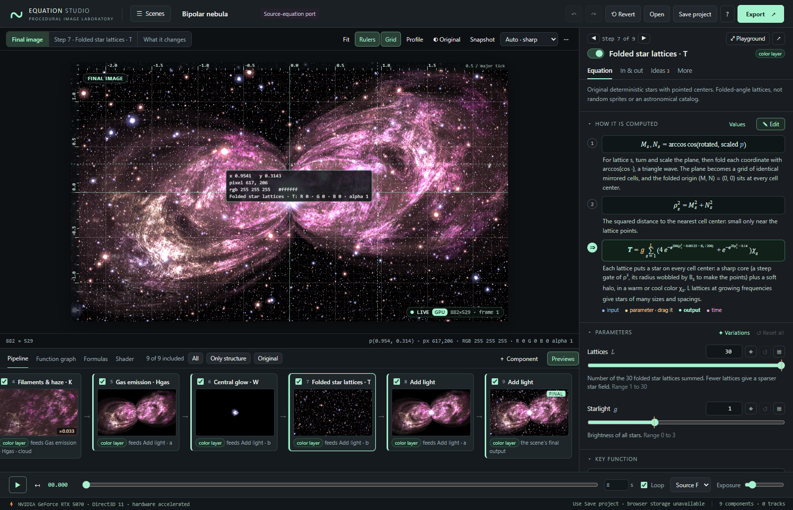
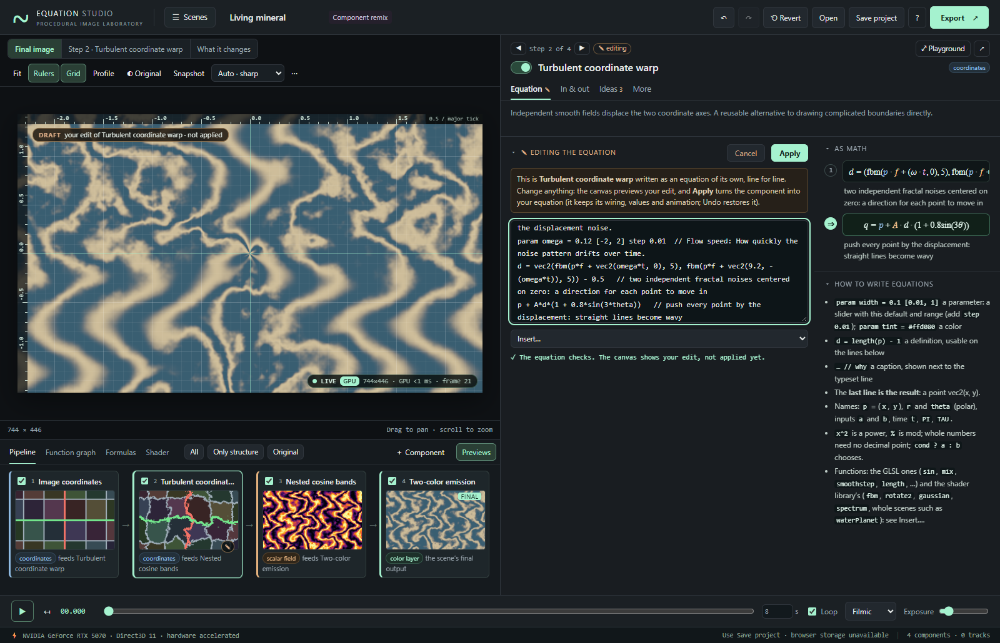

# Equation Studio

**A local GPU laboratory for equation art: see what every equation computes, why it is written that way, and what happens when you change it.**



Every image is a typed graph of small equations evaluated live, per pixel, on your GPU. The editor is built for understanding, exploring, decomposing and composing them:

- **Always know where you are.** The pipeline under the canvas is the map of the construction: every step in order with a live picture of its output. The panel on the right explains the step you select (*Step 7 of 9*), and a label on the canvas says what it shows: the final image, the selected step's own output, what that step changes, or a draft you are editing.
- **Understand the math.** Each component's equation is shown as numbered, typeset steps, each with a caption saying what the line computes and why. Symbols are colored by role (inputs, parameters, output, time); hover one to find it everywhere, click an input to follow it upstream, drag a parameter symbol to change it. *In & out* shows where each input comes from and where the output goes, down to the equation that uses it. *Ideas* explains the 30 recurring ideas (double-exponential gates, folding with arccos cos, backward mapping, fractal noise, front-to-back selection…) with small interactive plots, and a live plot shows each component's key function. The **Formulas** tab writes the whole construction as a formula sheet.
- **Edit the equation you are reading.** **✎ Edit** on any equation opens it as text, one line per step; a built-in component opens as its own math written out. Parameters are `param` lines that become sliders, definitions name intermediate values and `//` captions explain each line. The canvas previews your edit as a draft until you apply it, and mistakes are reported in words.
- **Study one equation in depth.** The **Equation Playground** (double-click any component) widens the panel: the equation beside its controls and plots, the step on the canvas with a profile of its actual values. **↗** pops the panel into its own window, e.g. on a second screen.
- **See every step.** The canvas shows the final image, any single step, or exactly which pixels a component changes. Values that have no color of their own (numbers, coordinates, geometry) get automatic colormaps with contour lines and a legend.
- **Experiment without fear.** Every parameter can be reset, and a marker shows its original value. Sweeps render a parameter across its whole range. Variations suggest nearby versions. Hold *Original* to compare, and *Revert* is undoable. Tick and untick components to bypass them and build the image up layer by layer.
- **Compose.** Drag components from the library onto the graph or an input, drag wires between sockets, insert a modifier on any input, or replace a component while keeping its wiring.
- **Fast on real GPUs, honest about it.** One compiled shader serves every view of a scene, so ticking boxes, walking steps and scrubbing parameters never recompile; wiring changes compile in the background with a visible *Compiling* indicator. The LIVE badge says whether a hardware GPU or software rendering does the work, and a performance dialog names the GPU and reports frame times.



It then animates parameters with keyframes and exports stills, frame sequences or video with the full project embedded. It works on wide screens, laptops, tablets and phones. The [editor guide](docs/EDITOR_GUIDE.md) covers every control, and every control in the app explains itself when hovered (or pressed and held on a touch screen).

## Open the app

**Open `Equation Studio.html` in a browser with WebGL 2 enabled.** This single file includes the application, styles, and small gallery thumbnails. It needs no npm installation, account, API key, network connection, or Python. The thumbnails are navigation aids; the artwork canvas is computed live from equations and never samples them.

For development, or when the browser restricts local files, use the included loopback-only server:

```bash
# macOS / Linux; Python 3.10+; no packages to install
python3 start.py

# Windows
py -3 start.py
```

The launcher opens `http://127.0.0.1:8765/`. Press Ctrl+C to stop. Use `--port 8766` if needed; `--no-open` only prints the address. Windows and macOS launchers are also included. macOS may require launching downloaded scripts from Terminal rather than double-clicking them. Do not override an organization's browser or device policies; use an authorized browser/environment.

Only Python's static server is involved in this second route. **Rendering remains in the browser**, not in Python. The supplied Python nebula renderer is an independent reference, not a hidden backend.

## What is reconstructed, and what is new?

| Construction | Delivered implementation | Evidence boundary |
|---|---|---|
| Original Bipolar Nebula | GPU port of the supplied equations, with the previous Python project retained | Full source equation reference and measured GPU/CPU comparison; not byte-identical across precision/backends |
| Stormy water planet | Sphere coordinates, seven cyclone warps, multiscale clouds, ocean glint, atmosphere | New procedural study of the requested subject; original formula sheet unavailable |
| Galaxy lensed by a star cluster | Shared cluster positions, softened lens map, spiral source galaxy, foreground lights | New illustrative model; not the artist's recovered formula |
| Spiral aurora | Logarithmic spiral ribbon, angular rays, layered emission | New procedural study; not an MHD simulation |
| Black hole stretching a star | Projected disk, illustrative rear arc, shadow, tapered stream, stellar glow | New stylized construction; not relativistic ray tracing |
| Peacock in full display | Reusable eye-feather stamp, four ordered fan rows, independent body/head | New construction; not an exact transcription of the linked artwork |
| Hedgehog and Fire | Quill-stamp/ellipse assembly; advected tapered flame field | Original teaching examples, **not transcriptions of the unavailable videos** |
| Ring Nebula, Marble, Kaleidoscope, One Feather | Additional remix/teaching scenes | Original demonstrations of component reuse |

There are **12 editable scenes and 43 typed component kinds**. The interface and the [research report](docs/RESEARCH.md) preserve the distinction between source reconstruction and interpretation. We did not recover the complete new formula sheets, video frames/transcripts, 2023 thread, or two third-party exchanges. No exact reconstruction of those inaccessible materials is claimed.

## First fifteen minutes

1. The **Bipolar Nebula** opens first. The **Pipeline** below the canvas shows its nine components in evaluation order, each with a live picture of its output. Click *Folded star lattices*: the panel on the right explains it (*Step 7 of 9*), while the canvas keeps showing the final image, as its label says. The equation takes three steps: fold the plane with arccos(cos ·) so that every lattice cell looks the same, measure the squared distance to the cell center, and put a star core and halo there. Hover a symbol to find it everywhere.
2. Choose **This step** above the canvas: now it shows the stars alone. Press `[` a few times to walk back through the construction step by step; the canvas follows, and the legend explains the colors of steps that have none of their own (a colormap for numbers, a warped grid for coordinates). Choose **What it changes**, then select the stars again: only the pixels they change stay in color. `Esc` returns to the final image.
3. In the panel, open **In & out**: the stars' output *T* is read by *Add light* as *B*, in RGB = A + gB. Open **Ideas** and turn the knob of *Folding with arccos(cos t)*.
4. Double-click *Pinched shell family* to open the **Equation Playground**: the panel widens, the canvas shows the shell geometry, and the profile under it plots its actual values along the line through the cursor. Drag the peach **η** in the equation sideways and watch the lobes pinch, or press **▦** next to *Neck pinch* to see the whole range at once. Hover a thumbnail to preview it, click to use it, then **↺** to put it back. `Esc` twice leaves the Playground.
5. Press **Only structure** in the pipeline bar, then tick *Folded star lattices*, then *Gas emission*. The image builds up one layer at a time, and ticking a component also includes what it needs. None of this recompiles the shader.
6. Open **☰ Scenes ▸ Living mineral**, select *Turbulent coordinate warp* and press **✎ Edit**. The warp opens as its own equation: two fractal noises make a displacement `d`, and the result is `p + A*d`. Change the last line to `p + A*d*(1 + 0.8*sin(3*theta))`: the canvas previews the draft. **Apply** keeps it (Undo restores the original), **Cancel** discards it.
7. Open **Kaleidoscope garden** and select *Interference petals*: an equation written with sliders, a definition and captions. Change `sharpness` with its slider, or edit a line. Open **Formulas** to read the whole scene as equations.
8. Open **Galaxy behind a star cluster**. Play the timeline and inspect the lens-strength keys. Untick the lens: a bypassed coordinate map passes its input through, so the galaxy appears unlensed while the foreground cluster stays in place. Select a numeric control and click **◆** to make a key; move the playhead, change the control, and a new key appears. Drag keys along their lane to retime them.
9. Press **Snapshot** before a risky change; the library's Snapshots tab brings the state back, and **⟲ Revert** restores the whole scene (undoably). Save the project JSON, then export PNG or a PNG sequence. PNG files from the Export dialog include the complete project and render settings as embedded text metadata.

## Editing and inspection

The top bar names the scene; **☰ Scenes** opens the library of scenes, components and snapshots as a drawer (dock it to keep it open). The center holds the live canvas and, below it, the Pipeline, the typed function graph, the formula sheet and the generated shader. The panel on the right explains the selected component in four tabs: **Equation** (its steps, parameters and key function), **In & out** (where its values come from and where its output goes), **Ideas** (why it is written that way) and **More** (its shader code, animation tracks, replace, duplicate, delete). Every control has a hover explanation.

Clicking a component selects it; the canvas shows what you choose above it: the **final image**, **this step** (the selected component's own output) or **what it changes**, and the last two follow the selection. Unticking a component bypasses it: a modifier such as a coordinate warp, tint or mask passes its input through unchanged, a combiner passes its main input, and content such as a field or star layer contributes nothing.

Wire components by dragging between dots, by clicking an output dot and then an input dot, or by choosing the input in the panel; drag a library entry onto a socket to add and connect in one step, use **＋** on an input to insert a modifier, and **Replace with…** to swap a component. Cycles and mismatched types are rejected. Graph layout is automatic and scrollable; this is not a free-position node-canvas editor. Parameter changes, bypassing and switching views update uniforms of one compiled program; wiring and equation changes compile a new one in the background. An equation with an error is never applied.

Drag the artwork to pan; scroll or pinch to zoom about the cursor; **Fit** resets the camera. **Rulers** and **Grid**, on by default, overlay world coordinates with a crosshair readout of position, pixel, color and raw field values; a click pins the readout. **Profile** plots raw values along a line. **Compare with a picture** (in the ⋯ menu) loads a local PNG/JPEG/WebP overlay or difference view. It does not infer equations, fit parameters, or affect exported artwork. Crop a reference before loading; the overlay is stretched to the canvas rectangle.

Projects autosave opportunistically to browser storage. Browser storage can be unavailable or cleared; **Save project** is the portable backup. Reference images are session-only and are not included in the saved project; snapshots and preferences stay in the browser. The complete list of controls and keyboard shortcuts is in the [editor guide](docs/EDITOR_GUIDE.md).

## Animation and export

**Animation is stateless:** a frame is a function of project parameters and time. Scrubbing backward does not require replaying a simulation. Most studies animate directly through a flow-speed parameter; the source nebula's default time dependence is zero to preserve its static source construction. Add keys or change its motion control to animate it.

| Export | Behavior |
|---|---|
| PNG | Current playhead; opaque displayed RGB; up to the lower of GPU limits and 4096 pixels per side; embedded project/settings metadata |
| PNG sequence ZIP | Explicit times `i/FPS`, end point excluded; PNGs, project JSON, and manifest; at most 240 frames, 1280 pixels per side, and 150 MB of compressed frame bytes |
| Browser video | One real-time timeline pass using a supported MediaRecorder codec; may drop frames on a slow device; exact frame count is not promised |

Use PNG sequences for reproducible frame times and lossless stills. Video support depends on browser codecs. A looping playhead does **not** guarantee a seamless visual loop: endpoint keys and procedural phases must also agree. See [Animation and export](docs/ANIMATION.md).

The preview has a 5:3 aspect ratio. Exporting another aspect ratio preserves horizontal world-space scale and reveals/crops the vertical extent; it does not stretch the scene. Preview resolution changes sample locations, not the number of original formula terms. Fine lines and stars can alias at low resolutions; there is no hidden temporal antialiasing or band removal.

## Project structure

```text
Equation Studio.html       Self-contained application, ready to open
index.html / style.css     Editable application shell and styling
src/
  catalog.js               43 component definitions: sockets, parameters, captioned steps, symbols, ideas,
                           key-function curves, GLSL emitters
  concepts.js              The 30 ideas behind the equations, with formulas and interactive plots
  graph.js                 Project schema, validation, graph traversal, history
  expression.js            The custom equation language: parser, type checker, GLSL printer
  fork.js                  Components as equations: what ✎ Edit opens, and applying an edited equation
  compiler.js              Typed DAG → one fragment program per graph structure; views are uniforms
  looks.js                 Automatic colors for values without colors: colormaps, statistics, look pass
  renderer.js              WebGL 2: background compilation, views and passes, thumbnails, probes, timing
  gpu-info.js              Hardware / software GPU detection
  math-render.js           TeX and custom equations → MathML with symbol roles
  formula.js, plot.js      The formula sheet; small SVG plots
  view-math.js             Camera arithmetic shared by the canvas, rulers and tests
  explore.js               Parameter sweeps, variations and original values
  graph-layout.js          Deterministic graph layout
  math-glsl.js             Low-level field, noise, shape, color and composition atoms
  source-constants.js      Float64 constant folding of source's fixed band expressions
  nebula-glsl.js           Original source nebula GPU kernels
  motifs-glsl.js           New subject-based kernels
  timeline.js              Deterministic parameter interpolation and key editing
  presets.js               Editable scene graphs
  export.js                PNG metadata and dependency-free ZIP export
  snapshots.js             Session bookmarks
  editor.js                Shared editor state, event bus and model operations
  ui-component-view.js     The component panel: header, tabs, steps, in-place equation editing (panel, pop-out)
  ui-*.js                  One module per panel or tool: library, canvas, looks and legend, profile,
                           pipeline, graph, formulas, previews, inspector, playground, pop-out, explorer,
                           performance, phone layout, tooltips, timeline, export, toolbar
  app.js                   Boot, frame loop and integration hooks
  research.js              Evidence/provenance ledger displayed inside the app
examples/                  Saved projects and an embeddable renderer example
reference/nebula_rewrite/  Retained complete Python project and original documentation
tools/                     Build, documentation, metadata extraction and verification
tests/                     Node tests; small browser-produced verification artifacts
docs/                      Guides, theory, recipes, API, research and measured validation
```

Browser-readable copies are included as `README.html` and `docs/*.html`, with typeset equations and no online scripts. Regenerating those reading pages is optional and uses `python3 tools/build_docs.py` with Pandoc installed.

Read the [Editor guide](docs/EDITOR_GUIDE.md), [Architecture and API](docs/ARCHITECTURE.md), [Construction recipes](docs/RECIPES.md), the [generated component catalog](docs/COMPONENTS.md) (every component's steps and the ideas behind them) and, for working on the code, the [Development guide](docs/DEVELOPMENT.md). The retained [original formula reference](reference/nebula_rewrite/docs/FORMULA_REFERENCE.md) maps every source symbol to its purpose. Changes are listed in the [changelog](CHANGELOG.md).

## Development and verification

No installation is needed to edit the source modules and serve them with `start.py`. Node 20+ is only needed for development tests and generating example JSON; Python 3.10+ builds the standalone file:

```bash
node --test tests/*.test.js
node tools/generate_catalog.js
python3 tools/build.py
python3 start.py
```

Optional browser tests need Python Playwright, NumPy and Pillow, and a Chromium (Playwright's bundled one works: `python3 -m playwright install chromium`). CPU reference tests additionally need the requirements in `reference/nebula_rewrite/`. Detailed commands, environment, measurements, and known gaps are in [Validation](docs/VALIDATION.md); the full regeneration checklist is in the [Development guide](docs/DEVELOPMENT.md). The single-file distribution should be rebuilt after modifying any runtime source module, HTML, CSS, or thumbnail.

## Performance and portability

This is WebGL 2, not WebGPU. All per-pixel math runs in fragment shaders on the GPU; there are no remote services or CPU-rendered preview substitutes. Web pages cannot run this kind of per-pixel work on a neural processing unit (NPU), so the GPU is the accelerator that matters; the LIVE badge, the footer and the **GPU & performance** dialog say which GPU is used and warn when the browser has fallen back to software rendering, with advice for enabling hardware acceleration.

A scene is compiled into **one** shader program that serves every view of it: parameters, bypass checkboxes, the stage shown, “what it changes”, thumbnails and probes are uniforms. Shader compilation, the one expensive operation, therefore happens only when the wiring or an equation changes, and then **in the background** where the browser supports it (`KHR_parallel_shader_compile`): the last image stays up with a *Compiling shader…* indicator and a progress cursor. On a Windows machine with an NVIDIA GPU (Direct3D 11 through ANGLE), the whole Bipolar Nebula compiles in about 0.4 s, and bypassing a component, which used to freeze the page for several seconds, takes a few milliseconds. **Auto quality** renders at the display's pixel density and lowers the resolution during a drag or playback when frames are slow, refining when you let go. Dense source formulas and a large peacock fan remain expensive on weak GPUs; choose a fixed lower quality there.

The published measurements in [Validation](docs/VALIDATION.md) were made in Chromium with the **ANGLE/SwiftShader software backend**, including full-resolution source comparison, so they are comparable between machines. The browser suites were also run on a hardware GPU (NVIDIA, Direct3D 11). Automated UI testing loads the actual bundled HTML into an in-memory page, so no browser policy is involved; file-URL and localhost browser navigation were not end-to-end tested by those suites. The HTTP launcher itself was tested separately. Phone and tablet layouts were checked in Chromium with touch emulation at iPhone and iPad sizes, not on physical devices; Safari, Firefox and iOS remain untested. WebGL absence, missing float support, recording codec errors, and context loss have explicit handling.

This is a procedural-art tool, not a physical astronomical/weather simulator, an automatic inverse-image-fitting system, a general 3D modeller, or a recovery of the artist's private design process.

## Attribution

The original **Bipolar Nebula** mathematical artwork is credited to **Hamid Naderi Yeganeh**. This project is independent and is not affiliated with or endorsed by the artist. New scene studies and software must not be represented as his original equations. See [Attribution](ATTRIBUTION.md) and [Research](docs/RESEARCH.md).
