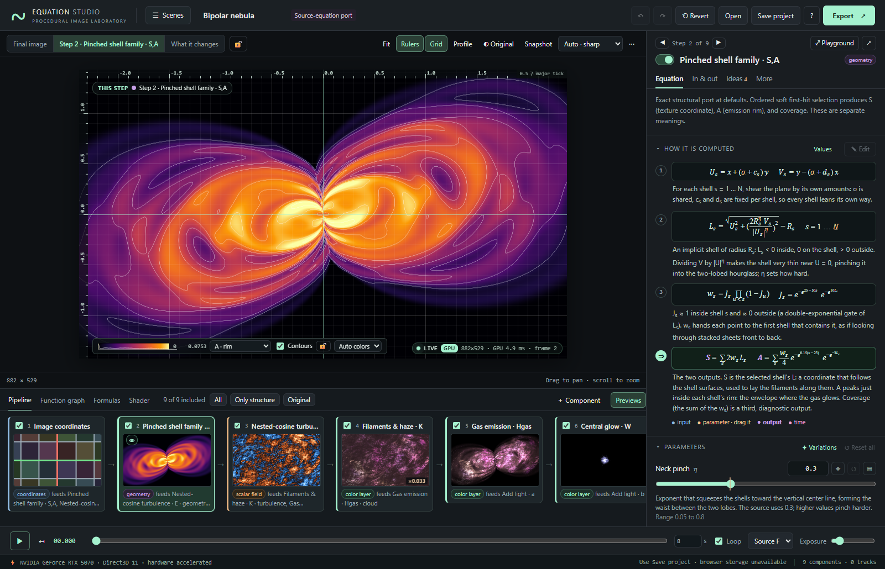
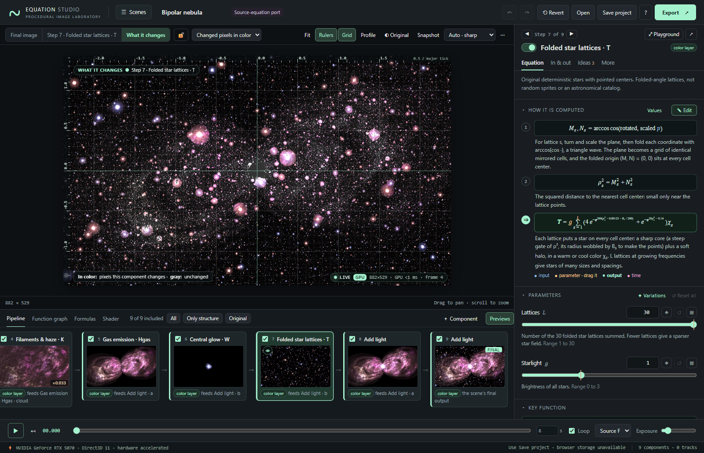
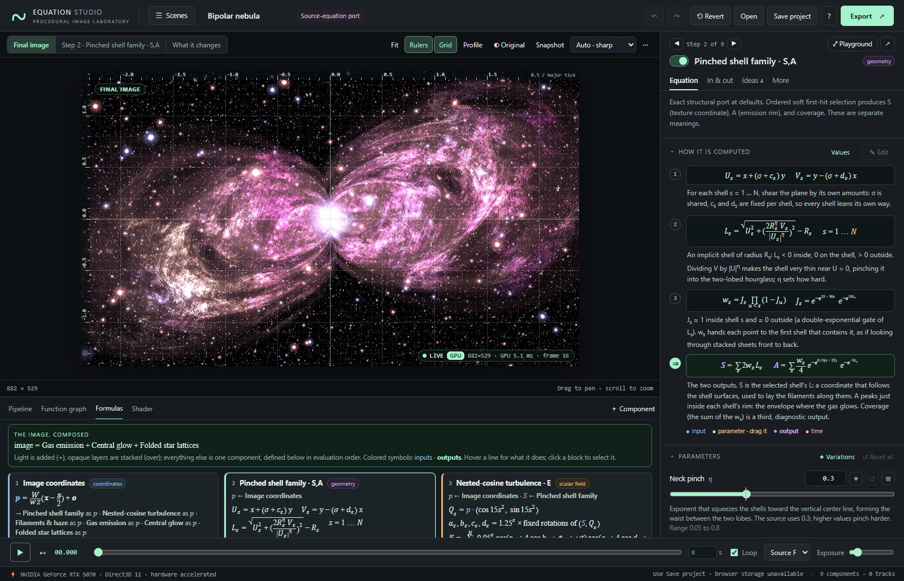
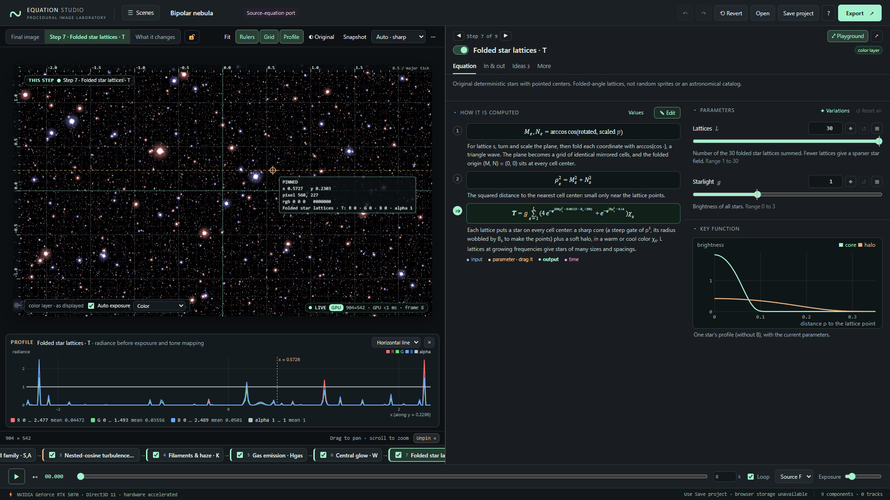
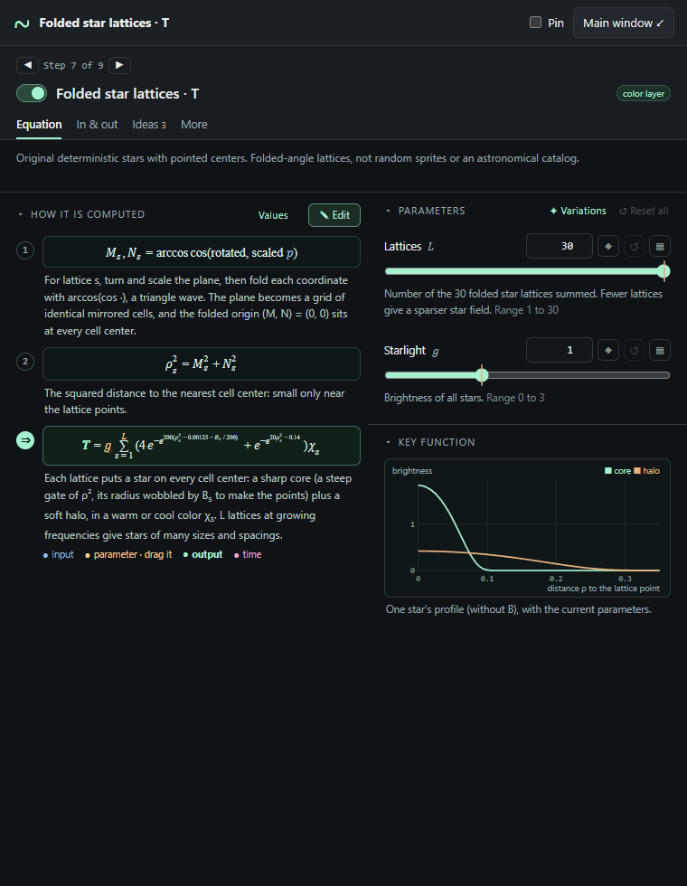
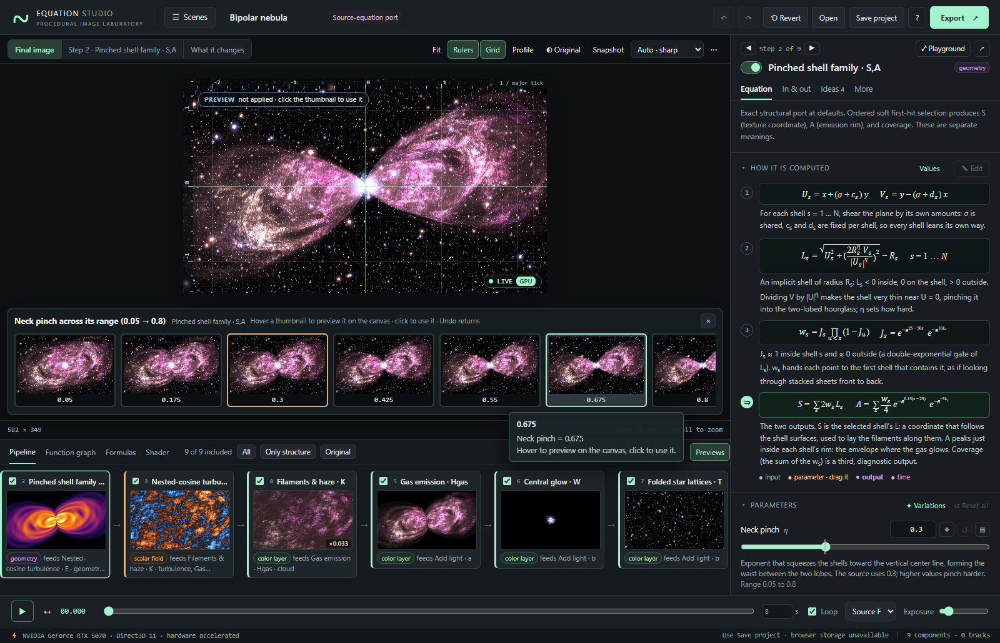
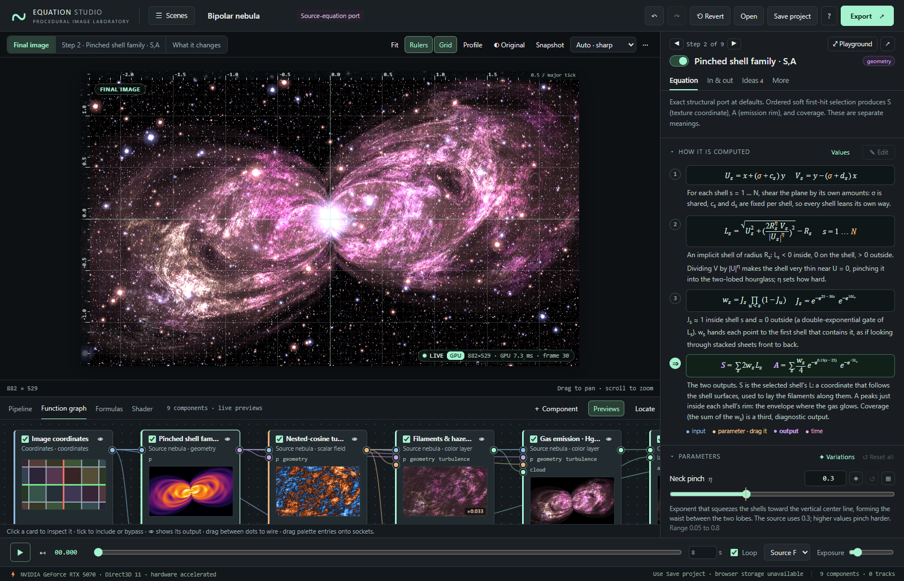
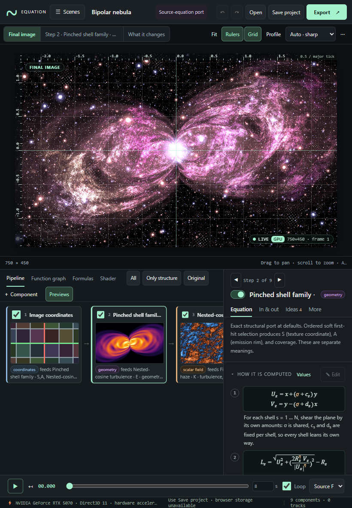
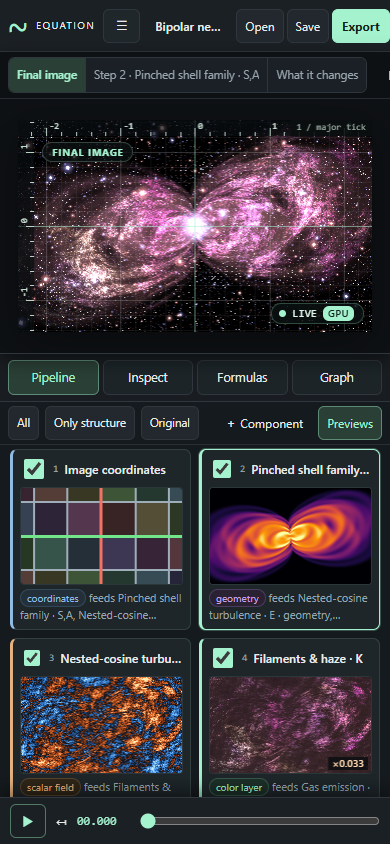
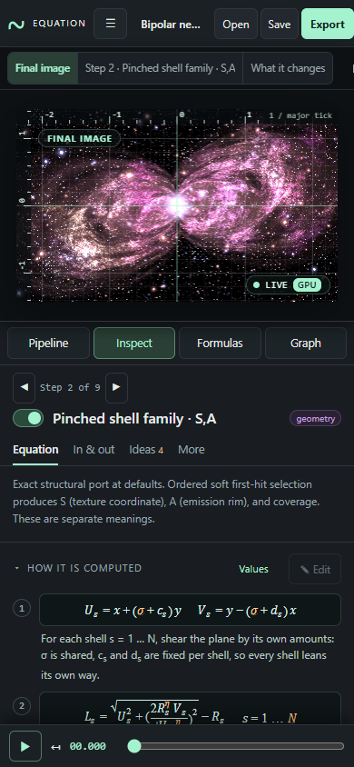

# Editor guide

A tour of every panel, gesture and shortcut in Equation Studio. The [README](../README.md) explains what the scenes are and what is or is not reconstructed; this guide explains how to read, understand, explore and edit a construction. Everything runs locally; nothing is uploaded. Hover any control in the app (or press and hold it on a touch screen) for a short explanation of what it does, its shortcut, and whether it is currently on.


## Is the picture live?

Yes. The canvas is computed on your GPU from the equations every time anything changes: a parameter, a wire, the camera, the playhead. There is no stored picture behind the canvas; the only saved pictures are the small scene thumbnails in the library.

The **LIVE** badge in the corner of the image shows whether a hardware graphics processor does the work (**GPU**) or the browser fell back to software rendering (**SOFTWARE**, in amber), the resolution, the time the last frame took on the GPU, and a frame counter; its dot pulses on each new frame. Click it, or the footer, for the **GPU & performance** dialog: the graphics processor and API, what it supports (float read-back, background shader compilation, GPU timers), the last frame time, the programs compiled for this scene and how long each took, and how to turn on hardware acceleration if it is off. Web pages cannot use a neural processing unit (NPU) for this kind of per-pixel work, so the GPU is the accelerator that matters.

When you change the wiring, add a component or apply an equation, the scene’s shader is recompiled **in the background**: the previous image stays up with a *Compiling shader…* indicator and a progress cursor, and the page keeps responding. Everything else (parameters, ticking components, choosing what the canvas shows) never recompiles.

## Where things are

| Area | Where | What it is for |
|---|---|---|
| Top bar | top | **☰ Scenes** opens the library; the scene’s title and its provenance label; undo and redo, Revert, Open, Save, help and Export |
| Canvas | center | The live image; above it, what it shows (**Final image**, **This step**, **What it changes**) and its tools |
| Pipeline | under the canvas | The construction step by step, with a live picture of every step’s output; tabs switch to the **Function graph**, the **Formulas** and the **Shader** |
| Component panel | right | The selected component: its equation, what goes in and out, the ideas behind it, and every control |
| Timeline | bottom | Play, scrub, duration, output conversion and exposure; a lane for every animated parameter |

The library is a drawer: **☰ Scenes** (or **＋ Component** in the pipeline bar) opens it over the left of the window, and it closes when you choose something, click elsewhere or press `Esc`. **⇥ Dock** keeps it open as a column instead. Drag the component panel’s left edge to make it wider or narrower, and the bar above the pipeline to give it more height; double-click either to reset.

### Three questions the screen always answers

- **Which scene am I in?** Its title in the top bar, with its provenance (*Source-equation port*, *Interpretive study*…; click the label for the research notes).
- **Which component am I looking at?** The one highlighted in the pipeline, and named at the top of the panel with its position: **◀ Step 7 of 9 ▶**. `[` and `]`, or the arrows, move to the previous and next step.
- **What is the canvas showing?** The highlighted button above it, and a label in the top-left corner of the image: **FINAL IMAGE**, **THIS STEP · Step 7 · Folded star lattices**, **WHAT IT CHANGES · …**, and, while it is temporarily showing something else, **DRAFT** (an equation edit not yet applied), **PREVIEW** (a sweep or variation under the pointer) or **ORIGINAL** (while you hold ◐ Original).

### Selecting and showing

**Clicking a component selects it**, wherever it is: a pipeline card, a graph card, a formula block, an input or output in the panel. Selecting never changes what the canvas shows: if the canvas shows the final image, it keeps showing it while the panel explains the component. Choose **This step** (`I`) to see the selected component’s own output, or **What it changes** (`C`) to see its effect; both then follow your selection as you click around or step with `[` `]`. **Final image** (`Esc`) returns. **Double-click** a component to study it in the [Equation Playground](#the-equation-playground).

## Reading a construction

### The Pipeline

The **Pipeline** lists every component in evaluation order, each after everything it reads. Each card shows a checkbox to include or bypass the component, its step number and label, a **live thumbnail of its output**, its output type and what it feeds, **FINAL** or **UNUSED** where they apply, 👁 when the canvas shows it, and ✎ when its equation has an edit that is not applied yet. Thumbnails of values that have no color of their own use the same automatic colors as the canvas (see below), each over its own range; a layer shown with adjusted exposure is labelled with the factor, e.g. *×0.033*.

Click a card to select it; the checkbox alone includes or bypasses it. The arrow keys move between cards when one has focus. The bar above the cards holds the bypass shortcuts (see [Including and bypassing](#including-and-bypassing-components)).

### The view switch

The switch above the canvas chooses what the canvas shows:

- **Final image** (`Esc`): the scene’s finished output, the same image Export and Save use.
- **This step** (`I`): only the selected component’s output, before anything downstream uses it. The button names the step, e.g. *Step 2 · Pinched shell family*.
- **What it changes** (`C`): the final image rendered with and without the selected component (bypassed). *Changed pixels in color* keeps the image where the component matters and turns the rest gray; *Signed difference* is warm where it adds light and cool where it removes light.

In the step and change views the canvas follows your selection. Press **🔓** to lock it, e.g. to watch a field while you tune something upstream of it; select another component and the canvas stays where it is until you unlock.





### Step colors and the legend

Colors, layers and lights appear as themselves. Numbers, coordinates and geometry have no color of their own, so the canvas chooses one from the values actually in view, and the legend at the lower left explains it:

| Output type | Automatic colors | Legend |
|---|---|---|
| scalar field | a colormap from the lowest to the highest value; when the field takes both signs, a diverging map: cool below zero, near-black at zero, warm above, symmetric about zero. White contour lines where the field crosses round values; the zero line is brighter | a color bar with the range and a histogram of the values in view |
| coordinates | the image of a regular grid: each cell of the output coordinates keeps its own pastel color, gray lines at multiples of the cell size, red where q_x = 0 and green where q_y = 0. A warp bends the grid; polar coordinates turn it into rings and spokes | the cell size |
| geometry | one channel as a scalar field: S (the shell-following coordinate), A (the rim) or coverage; or all three in the classic red/green/blue | a channel menu |
| color layer | as displayed, unless it is almost entirely clipped white or black at the scene exposure: then its exposure is adjusted so its structure is visible | the factor, e.g. *×0.033 exposure* |

The legend’s controls choose the channel, contours, auto exposure and **Classic** colors (the fixed 1.x diagnostic: gray = ½ + ½·tanh(value); red/green = ½ + ½ sin of the coordinates; red rim, green coverage, blue warp). **🔓** locks the current color range, so you can change a parameter and compare colors fairly. On a narrow image the controls fold behind **⚙**. The rulers’ readout and the profile give the exact numbers behind any color.

### Rulers, grid and readouts

**Rulers** (`R`) and **Grid** (`G`) are on by default. The rulers show world coordinates with a 1–2–5 tick spacing that adapts to the zoom; the top-right corner shows the size of a major tick. The crosshair follows the cursor with the world coordinate, the pixel, the displayed color and the **raw value of the shown component** (in the step view) or the selected component (otherwise). Click the image to **pin** the reading; it stays and updates as you edit or scrub. **Unpin** or `Esc` removes it. Alt-click reads one raw value into a message. Rulers, grid, readouts and labels are never part of an export.

### The profile

**Profile** (`V`) opens a plot under the canvas of the shown component’s **actual values** along the horizontal (or vertical) line through the cursor, or through the pinned reading. A dashed line on the image shows where it samples. Scalars plot one curve, coordinates their x and y, geometry S, A and coverage, layers their red, green, blue radiance (before exposure and tone mapping) and coverage. Below the plot are each channel’s minimum, maximum and mean along the line. The profile makes a function’s shape obvious: a Gaussian ring’s bump, a threshold’s step, the zigzag of a fold, the spikes of stars.

### The Formulas tab

**Formulas** writes the whole construction out as a formula sheet. At the top, **the image, composed**: the combiners (Add light, Front over back, Tint, Mask, Combine scalar fields) written as operations over the components they combine, e.g.

*image = Gas emission + Central glow + Folded star lattices*

Below it, every component in evaluation order, with each input bound to the component that feeds it (*p ← Image coordinates · S, A ← Pinched shell family*), its equation, and where its output goes (*→ Add light as B*). Hover a line for its explanation; click a block to select that component.



### The camera

Drag to pan. Scroll or pinch to zoom about the point under the cursor. **Fit** (`F`) restores the native framing; at 2000 × 1200 the canvas reproduces the supplied source grid exactly. The camera is part of the project and is saved and undone like any other edit.

The quality menu sets how many pixels the canvas computes. **Auto · sharp** (the default) matches your display, including high-density screens; during a drag or playback, when frames take longer than about 24 ms on the GPU, it renders at a lower resolution and refines when you let go. The fixed sizes render exactly that width. Every setting evaluates the same equations; exports choose their own size.

## The component panel

The panel on the right explains and edits the selected component. Its header stays in view while you scroll: **◀ Step 7 of 9 ▶**, the switch that includes or bypasses it (see below), its title (editable; the id stays fixed) and output type, **⤢ Playground** and **↗** (pop out). Under it, four tabs; the panel keeps the tab you chose as you select other components, and starts each component at its top.

- **Equation**: what it computes.
  - A sentence on what the component is for, and a warning if it is bypassed or not connected to the final output.
  - **How it is computed**: the component’s equation as numbered steps, each typeset and followed by a caption that says what the line computes and why. The result line is marked **⇒**. Symbols are colored by role: **inputs** in the color of their type (blue coordinates, amber scalars, violet geometry, green layers), **parameters** in peach, the **output** bold, **time** in pink. Hover any symbol to light up all its occurrences and its parameter; click an input symbol to select the component that feeds it; **drag a parameter symbol sideways** to change it (hold Shift for fine steps; one drag is one undo step). **Values** replaces every parameter symbol by its current number, updated live. **✎ Edit** opens the equation as text: see [Editing equations](#editing-equations).
  - **Parameters**: each says what it does, in plain language, next to its symbol. Next to the value are **◆** (add a key at the playhead), **↺** (reset) and **▦** (sweep). A marker on the slider shows the original value. **✦ Variations** and **↺ Reset all** are in the heading.
  - **Key function**: for components built around a one-dimensional function, a live plot of it with the current parameters: the S-curve of a soft threshold, the profile of a ring or disc, the core and halo of one star, the twist of a vortex against distance, the width of a tidal stream along its length.
- **In & out**: where each input comes from (the component that feeds it, which you can change with the menu, **＋** to insert a modifier on it, and its thumbnail), and where the output goes: every component that reads it, the symbol it goes by there, and the downstream equation that uses it, e.g. the stars’ output *T* is read by *Add light* as *B* in RGB = A + gB. Click one to select it. **☆ Make it the final output** changes what the scene outputs, saves and exports.
- **Ideas**: why the equation is written this way: the recurring ideas it uses, e.g. *Folding with arccos(cos t)*, *The double-exponential gate*, *Front-to-back selection*, each with its formula, an explanation and often a small plot with a knob to play with; and the equation’s other symbols (fixed constants, intermediate quantities) and what they mean.
- **More**: the shader code the component adds (and, for components that call a library function, that function’s source), its animation tracks (interpolation, keys), and **Replace with…**, **Duplicate** and **Delete**.

Sections fold with the ▸ in their heading.

## The Equation Playground

**⤢ Playground** (`E`, the button in the panel’s header, or double-click any component) turns the panel into a workspace for studying one component: the panel widens to half the window, and on a wide screen its Equation tab gets two columns, the steps on one side and the parameters and key function on the other. The canvas shows the component’s own output with the **profile** of its values under it, and the pipeline becomes a compact strip of step names, so the canvas keeps its height. Nothing else moves: you still navigate with the strip, `[` `]` or ◀ ▶. `Esc` first returns the canvas to the final image, then closes the Playground; ⤢ or `E` closes it at once.



### The pop-out window

**↗** opens the panel for the selected component in a separate browser window, for example on a second screen next to a full-size canvas. It follows your selection; tick **Pin** to keep it on one component while you select others. Its controls change the scene in the main window, and `Ctrl/⌘ Z` undoes there too. The window closes with the page. If the browser blocks pop-ups, the Playground opens instead; phones and tablets, which open no second windows, hide ↗ and use the Playground.



## Editing equations

Every component whose inputs are numbers or coordinates can be edited as an equation: the custom components, and the built-in components that do not read color layers or geometry. The same three steps work for all of them:

1. **✎ Edit** in the heading of *How it is computed* (or double-click the equation). The steps turn into an editor holding the equation as text, one line per step; the panel widens to give it room. For a built-in component, this is the component written out in the equation language, line for line with the steps you were reading, with its parameters as `param` lines named after their symbols (κ becomes `kappa`, c_x stays `c_x`) at their current values.
2. **Change anything.** As you type, the lines are typeset under **As math** exactly as the steps will read, the checker reports mistakes in words (*Line 3: Unknown name “raduis”. Did you mean “radius”?*; *Cannot add a vec2 and a vec3*; *The result must be a number (float), but it is a vec2*), and the **canvas previews your edit** a moment after you pause, labelled **DRAFT**. The draft is kept while you look at other components (the pipeline marks it ✎); only the selected component’s draft is previewed.
3. **Apply** (`Ctrl/⌘ Enter`) puts it into the scene as one undo step; **Cancel** discards it. An equation with an error is not applied, and nothing else changes. A built-in component becomes your equation when you apply: it keeps its wiring, parameter values and animation, and its label gets “· equation”; Undo restores the original.


When you apply, a parameter keeps its current value if its `param` line is unchanged; if you edit its default (`param bands = 14` to `= 30`), it takes the new default. Parameters that no longer exist are dropped with their animation.

Components that read a color layer or geometry (tint, mask, the combiners, most of the source nebula) cannot be written as equations yet; their ✎ Edit is dimmed and says why. Some built-in components are loops over many terms (the star lattices, the nebula clouds, whole scenes such as the water planet): their equation is a call of the shader-library function that does the loop, whose code is under More ▸ Shader code. You can still change what goes into it and what comes out.

### The equation language

An equation is a short program, one statement per line:

```text
// A glowing ring (lines starting with // are ignored)
param radius = 1 [0.1, 3]      // distance of the rim from the center
param width = 0.1 [0.005, 1]   // thickness of the rim
d = length(p) - radius         // signed distance to the circle
exp(-(d / width)^2)            // a Gaussian bump across it: the result
```

- `param name = value [min, max]` adds a **parameter** with a slider (`step 0.01` after the range sets its step). It behaves like any other parameter: reset, sweep, keyframes, variations. `param tint = #ffd080` adds a color.
- `name = expression` is a **definition**, usable on the following lines.
- The **last line is the result**: a number for a scalar equation, a pair `vec2(…)` for a coordinate equation, a color `vec3(…)` (or `vec4(…)` with coverage) for a color equation.
- `// …` after a line is its **caption**, shown next to the typeset line in *How it is computed*.

Available names: `p` = (`x`, `y`), its polar radius `r` and angle `theta`, the optional inputs `a` and `b`, the time `t`, `PI` and `TAU`. You can call the GLSL built-in functions (`sin`, `mix`, `smoothstep`, `length`, `clamp`, …) and every function of the shader libraries: helpers such as `fbm`, `noise2`, `rotate2`, `gaussian`, `cutoff`, `softInside`, `spectrum`, `vortex`, `domainWarp`, `angularMirror`, and whole kernels such as `waterPlanet(p, 1, 0.6, 5, 2, t)` or `nebulaStars(p, 30, 1)`. The **Insert…** menu under the editor lists them with their arguments, and *How to write equations* beside it summarizes the rules. Whole numbers need no decimal point; `x^2` is a power (written out as `x·x`, so it is exact for negative `x`); `%` is `mod`; comparisons, `&&`, `||` and `cond ? a : b` work as in GLSL. Equations are checked and re-printed as shader code by the studio, never pasted into it, and they cannot contain loops or JavaScript.

To start from scratch, add a **Custom scalar**, **Custom coordinate** or **Custom color** equation (＋ Component); each starts from a short example with a slider, a definition and captions.

## Experimenting safely

Nothing you try is hard to take back:

- **↺ on a parameter** returns it to its value when the scene was opened (for a component you added, its default), and removes its animation. Double-clicking the parameter’s label does the same. Changed parameters are marked with a dot, and **↺ Reset all** resets the whole component.
- **◐ Original**: press and hold the button, or hold `O`, to see the scene as it was when you opened it.
- **⟲ Revert** restores the whole scene as it was opened; your selection, view and playhead stay, and Undo brings your changes back.
- **Undo and redo** (`Ctrl/⌘ Z`, `Ctrl/⌘ Shift Z`) cover every edit, including the camera, bypass checkboxes, dragged symbols and applied equations.
- **Snapshot** (`S`) bookmarks the project and playhead in the library’s Snapshots tab. Up to thirty are kept in this browser; they are not part of the saved file.

### Sweeps and variations

**▦** on a parameter opens the explorer below the canvas with the image rendered at seven values across the parameter’s whole range. **✦ Variations** renders eight random variations of the component’s parameters (or the whole scene’s), subtle, medium or bold; **⟳ Shuffle** makes new ones. Hover a thumbnail to preview it on the main canvas (labelled **PREVIEW**), click it to use it. The thumbnails use the current view, so a sweep while showing a step shows how that step changes.



## Including and bypassing components

Every component has a checkbox, on its pipeline card, its graph card and as the switch in the panel. Unticking it **bypasses** the component: a **modifier** (a coordinate map, a Tint, Mask or Soft threshold) passes its input through unchanged; a **combiner** passes its main input (Add light passes A, Front over back the back layer, Combine scalar fields a); **content** (a field, shape, light or star field) contributes nothing. The tooltip on each checkbox says exactly what that component will do when bypassed. Ticking a component also ticks anything it needs. In the pipeline bar, **All** includes everything, **Only structure** bypasses every content component so you can tick them one at a time and watch the image build up, and **Original** restores the scene’s own choice.

Bypassing is instant: it never recompiles the shader.

## Composing

**＋ Component** opens the library at its **Components** tab: every building block, with a live search. Hover an entry to see its description and typeset equation. Click it to add it (its inputs connect to the selection when the types match; the new component is selected and the canvas shows its output, This step), or drag it onto the graph, onto an **input dot** (added and wired into that socket), onto a **component card** (wired into its first compatible input) or onto the canvas. Dock the library first when you want to drag several.

In the panel’s **In & out** tab, **＋ on a connected input** inserts a modifier between that input and whatever feeds it; **More ▸ Replace with…** swaps the component for another with the same output type, keeping connections wherever the sockets match. The Filament ring scene is the Bipolar Nebula with its geometry replaced exactly this way.

### The function graph



The **Function graph** tab shows the wiring, laid out automatically by dependency depth. Cards carry a colored edge and dots by type: blue coordinates, amber scalars, violet geometry, green layers. Each card has an include checkbox, a 👁 button that selects it and shows its output (This step) and, with **Previews** on (`P`), a live thumbnail. Hover a card to dim everything unrelated to it. Drag from an output dot to an input dot to wire them (compatible sockets light up), or click one and then the other; drag a wire off an input to disconnect it. Connections that would form a cycle or mix types are refused. **Locate** (`L`) scrolls to the selected card; with the graph focused, `Delete` removes the selected component and `Ctrl/⌘ D` duplicates it.

The **Shader** tab shows the fragment shader for the current view, with each component’s statement labelled by its id and its parameters named `n3_radius`. **Copy GLSL** copies it.

## Animation and the timeline

Space plays and pauses; ↤ rewinds; `,` and `.` step one frame at 24 fps; `Home` and `End` jump to the ends. The duration, **Loop**, output conversion (Source, Filmic, Linear) and exposure are project settings.

Click **◆** next to a parameter to add a key at the playhead. After that, changing the parameter at another time adds or updates a key there. Each keyed parameter gets a lane in the timeline: click the lane to seek, click a key to jump to it, and drag a key to retime it. In the panel’s **More** tab, choose smooth, linear or hold interpolation, or delete keys and tracks. Parameters declared in an equation animate the same way. See [Animation](ANIMATION.md) for the interpolation rules and export determinism.

## Export

**Export** renders a still PNG at any size up to the GPU limit (with the full project embedded as metadata), a deterministic PNG sequence in a ZIP with the project and a manifest, or a real-time browser video. When the canvas shows a step or a “what it changes” view, a checkbox exports that view instead of the final image, in the colors the canvas shows (a step keeps the color range it has on the canvas for every frame). Details and limits are in [Animation and export](ANIMATION.md).

## Screens, tablets and phones

- **Wide screens**: the panel takes about a quarter of the window and gets two columns wherever it is wide enough (the Playground, while editing, a wide pop-out window). Dock the library if you like it open.
- **Laptops**: the library is a drawer, so the canvas takes the width it frees; the pipeline’s height adapts to the window.
- **Tablets held upright**: the canvas across the full width, the pipeline and the panel side by side below it.
- **Phones**: the canvas stays pinned at the top while the panel below it scrolls; the tab bar under the canvas chooses the panel (**Pipeline**, **Inspect**, **Formulas**, **Graph**). Pipeline steps wrap two to a row. The transport stays at the bottom of the screen. Double-clicking a step (the Playground) opens its explanation under the canvas.
- **Touch**: drag to pan and pinch to zoom the canvas; drag parameter symbols in an equation like sliders; **press and hold** any control for its explanation. Controls are larger on touch screens.
- **Trackpads**: pinch to zoom, drag to pan.



 

## Keyboard shortcuts

Single-key shortcuts apply when no text field or dialog has focus.

| Keys | Action |
|---|---|
| `Space` | Play / pause |
| `Home` / `End` | Go to the start / end |
| `,` / `.` | Step one frame back / forward |
| `[` / `]` | Select the previous / next component (the canvas keeps its view) |
| `I` | Show the selected component’s own output, This step (again: the final image) |
| `C` | Show what the selected component changes |
| `E` | Open or close the Equation Playground |
| `V` | Show or hide the profile |
| `Esc` | Back out one level: close the library, cancel a connection, close the explorer, unpin a reading, leave an unchanged edit, return to the final image, close the Playground |
| hold `O` | Compare with the original scene |
| `P` | Toggle live previews |
| `R` / `G` | Toggle rulers / grid |
| `F` | Fit the camera |
| `S` | Take a snapshot |
| `L` | Locate the selected component in the graph |
| `Ctrl/⌘ Z`, `Ctrl/⌘ Shift Z` | Undo, redo |
| `Ctrl/⌘ S` | Save the project JSON |
| `Ctrl/⌘ D` | Duplicate the selected component |
| `Ctrl/⌘ Enter` | Apply the equation being edited |
| `Delete` / `Backspace` | Delete the selected component (graph focused) |
| `Alt`-click canvas | One-off raw value |

## What is remembered

The project autosaves to this browser’s storage a moment after every edit, together with the scene as it was opened (so Original, reset and Revert still work after a reload). Preferences are stored the same way: quality, rulers, grid, previews, profile, step colors, the bottom tab, the pipeline height, the panel widths, the Playground and whether the library is docked. So are snapshots. Unapplied equation edits are not saved. Browser storage can be unavailable or cleared, so **Save project** remains the portable backup. Reference images are never stored.
