# Editor guide

A tour of every panel, gesture and shortcut in Equation Studio. The [README](../README.md) explains what the scenes are and which of them use an artist’s own formulas or code. This guide explains how to read a scene, take it apart, play with it and build your own. Everything runs on your computer; nothing is uploaded. Hover any control in the app (or press and hold it on a touch screen) to see what it does, its shortcut, and whether it is on. **? Help** in the top bar opens a short version of this guide.


## Is the picture live?

Yes. Your graphics chip (GPU) computes the picture from the math every time anything changes: a setting, a wire, the camera, the time. There is no stored picture behind it. The only saved pictures are the small thumbnails in the Scenes gallery.

The **LIVE** badge in the corner of the picture says whether a hardware graphics chip does the work (**GPU**) or the browser fell back to software rendering (**SOFTWARE**, in amber). It also shows the resolution, how long the last frame took on the GPU and a frame counter, and its dot blinks on each new frame. Click it, or the GPU label in the footer, for the GPU dialog (*Your GPU and how fast it draws*). It names the graphics chip and its API, says what it supports (float read-back, background shader compilation, GPU timers), and lists the last frame time, the programs compiled for this scene and how long each took. When hardware acceleration is off, it says how to turn it on. Web pages cannot use a neural processing unit (NPU) for this kind of per-pixel work, so the GPU is the accelerator that matters.

When you change the wiring, add a part or apply an edit, the scene’s shader is recompiled **in the background**. The previous picture stays up with a *Compiling shader…* indicator and a progress cursor, and the page keeps responding. Everything else (settings, switching parts on and off, choosing what the picture shows) never recompiles.

## Where things are

| Area | Where | What it is for |
|---|---|---|
| Top bar | top | **☰ Scenes** opens the gallery. Then the scene’s name and a line saying where it comes from, **↶ ↷** (undo and redo), **⟲ Start over**, **Open**, **Save**, **? Help** and **Export** |
| Picture | center | The live picture. The view switch above it chooses what it shows (**Whole picture**, **Just this part**, **What this part adds**, **What moves**); on the right are **Fit**, **◐ Hold to compare** and the **View ▾** menu |
| Parts strip | under the picture | The parts the scene is built from, in order, each with a small live picture of what it makes. Its tabs switch to **Wiring**, **All the math** and **Shader code** |
| Side panel | right | Either the whole scene (**About this scene**: its story, **Try this**, how it works, its parts) or one part (its math or code, and every control) |
| Time bar | bottom | **▶** and **⏮**, the time in seconds, the time bar with frames of the whole animation under it, **Speed**, **Loop** and **Length**; a lane for every setting with keyframes |
| Footer | very bottom | The GPU doing the work (click it for details), **◐ Contrast**, whether your work is kept in this browser, and how many parts the scene has |

The library is a drawer with three tabs: **Scenes**, **Parts** and **Snapshots**. **☰ Scenes** opens it on the gallery, and **＋ Add a part** (above the parts strip) opens it on the parts. It closes when you choose something, click elsewhere or press `Esc`. **⇥ Keep open** turns it into a column next to the picture instead. At its bottom, **◈ Where these came from** opens the notes on every scene’s sources.

The **View ▾** menu holds everything about how the picture is shown: **Rulers**, **Grid** and **Measure along a line**; **Brightness**, **Light to color** and **Sharpness**; **Frames on the time bar**; and **Snapshot**, **Compare with a picture…**, **Copy image** and **Expand the picture** (which hides the side panels until you choose it again).

Drag the side panel’s left edge to make it wider or narrower, and the bar above the parts strip to give the parts more room. Double-click either one to reset it.

### Three questions the screen always answers

- **Which scene am I in?** Its name is in the top bar, followed by a line that says where it comes from: *By Xor · the artist’s own code*, *The artist’s own nebula formulas*, *Our own study*, *Built from parts*… Click that line for *Where these came from*, with the notes and links to every source.
- **What is the panel about?** Its top tells you. **ABOUT THIS SCENE** means the whole scene. A part shows where it sits in the scene instead, **Part 3 of 4**, with **‹ Whole scene** to go back. `[` and `]`, or ◀ ▶, open the previous and next part.
- **What is the picture showing?** The highlighted button above it, and a label in its top-left corner: **WHOLE PICTURE**; **JUST THIS PART · Part 7 · Folded star lattices**; **WHAT THIS PART ADDS · …**; **WHAT MOVES** or **TRAILS**; **VALUE** *depth* **inside Part 1 · …** when a value of the code is shown. While the picture shows something for a moment only, the label says so: **AS IT STARTED** while you hold ◐ Hold to compare, **DRAFT** while you edit math or code you have not applied yet, and **PREVIEW** while the pointer is on a small picture in a sweep or in Surprise me.

### Opening a part

**Clicking a part opens it in the side panel**, wherever you click it: a card in the parts strip, a line in *How it is built*, a card in the Wiring view, a block in All the math, or an input or output in the Connections tab. Opening a part never changes what the picture shows. If it shows the whole picture, it keeps showing it while the panel explains the part.

To see the part on the picture, choose **Just this part** (`I`), which shows only what the part makes, or **What this part adds** (`C`), which shows what it changes. Both then follow you as you open other parts or step with `[` `]`. **Whole picture** (`Esc`) goes back. **Double-click** a part to open it in the [wide panel](#the-wide-panel).

## What the colors mean

The same four colors mean the same thing everywhere in the studio:

| Color | It means | Where you see it |
|---|---|---|
| Orange | something you can change | sliders, the numbers in code that you can drag, the letters of settings in the math, **Try this** |
| Pink | time | the letter t, the play button, the time and the time bar, keyframes ◆ once they are set, **What moves** |
| Blue | what comes into a part | letters in the math that come from earlier parts, like where the pixel is |
| Green | what a part makes | the result in the math, the final picture, checks that passed (✓) |

Everything else, such as the part you have open, the tabs and the menus, is plain gray and white, so a color always tells you something. The Wiring view adds one more set of colors, for the kind of thing that travels along each wire (see [The Wiring view](#the-wiring-view)).

## Choosing a scene: the gallery

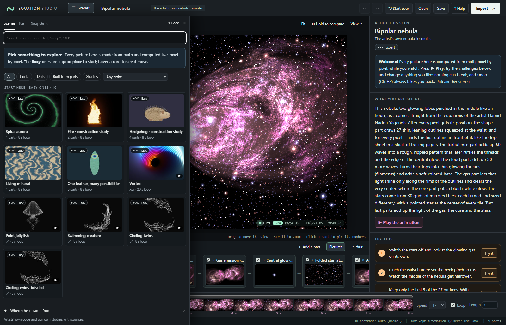

On your first visit the Scenes gallery opens by itself, with a welcome line: *Pick something to explore.* It lists **Start here · easy ones** first. Then come the others, grouped by kind: animations made from code (twigl), animations made of dots (p5.js), our own studies, and scenes built from parts. Every card has a difficulty badge, **Easy** (●○○), **Medium** (●●○) or **Expert** (●●●), and says how long its loop is in seconds you can read at a glance (6.3 s, 47 s).

The chips above the cards (**All**, **Code**, **Dots**, **Built from parts**, **Studies**) and the artist menu narrow the list, and the search box finds names, artists, tags and descriptions. Each card shows a saved thumbnail. Hold the pointer over it (or focus it with the keyboard) and it comes alive: the scene is drawn small and live from its math.

Click a card to open the scene. It starts playing at once, unless your system asks for reduced motion, and the side panel tells its story. Once you have chosen a scene from the gallery, the gallery stops opening by itself; **☰ Scenes** always brings it back.

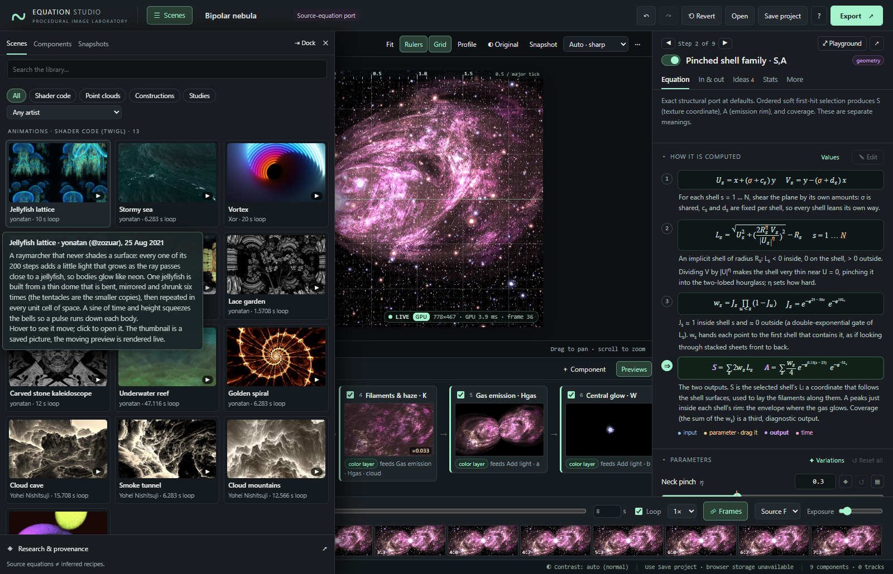

## The scene panel and Try this

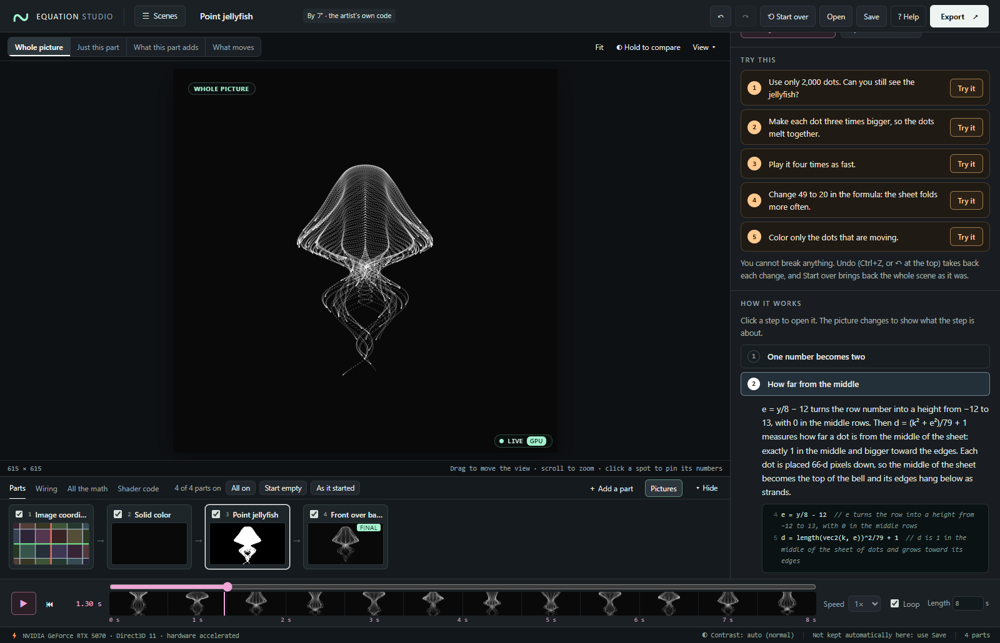

When a scene opens, the side panel shows **About this scene**. At the top are the scene’s name, who made it (with a link to the original post for the artists’ works) and its difficulty badge. An artist’s work also gets a check badge. **✓ Made from the artist’s own code** (or **sketch**) means the picture was compared with what the artist’s own code draws. **Our own study of the look** means the artist did not publish code, so the scene is our own attempt at the look. On your first visit a welcome note sits under the badges. Then come these sections, in the order a newcomer needs them:

- **WHAT YOU ARE SEEING** tells the scene’s story in plain words: what you see first, then how the math makes it. **▶ Play the animation** starts it (the button then says **❚❚ Pause**). **Open its code ›** (or **Open its formula ›**) opens the part that holds the artist’s code.
- **TRY THIS** has numbered challenges, each with a **Try it** button (see below).
- **HOW IT WORKS** walks through an artist’s code one idea at a time (see below).
- **HOW IT IS BUILT** lists the parts in order, each with a small live picture and one line on what it does. Click one to open it. A part that is switched off, or that nothing uses, says so.
- **BIG IDEAS** shows the math ideas the scene uses as chips. Click one to read about it in a part’s **Big ideas** tab, where it has a small graph to play with.
- **WHERE IT COMES FROM** shows an artist’s code exactly as it was posted.

The scenes built from parts have a guide of their own, with the same story, difficulty and challenges. A scene you built yourself shows its description and its parts.

### Try this

Each challenge makes one change that you can see. It may change a setting (*Use only 2,000 dots. Can you still see the jellyfish?*), make a small edit to the code or formula (*Change 5 to 9 in the color line…*), switch a part off, show just one part or what moves, put a value of the code on the picture, or build the picture up one loop step at a time. Press **Try it** and the change happens; most challenges also start the animation, so you see the change move. A challenge you have tried gets a ✓, and its button says **Again**.

You cannot break anything. **Undo** (`Ctrl/⌘ Z`, or ↶ in the top bar) takes back a changed setting, a code edit or a switched-off part in one step. **Whole picture** above the picture (or `Esc`) goes back from a changed view, and `Esc` also stops a build-up. **⟲ Start over** brings back the whole scene as it was. If a challenge no longer fits the scene, for example because you deleted its part or rewrote its code, it is dimmed.

### How it works

For the artists’ works, **HOW IT WORKS** is a walk-through in numbered steps. Click a step to open it. It explains one idea in a few sentences and shows the lines of code (or of the formula) it is about. Some steps also change the picture while they are open: they put one value of the code on it (the label says **VALUE** and its name), or stop a loop early so that you see the picture half-built. The step says what it changed. Click the step again, or **✕ Close the step**, to go back to the full picture.

**See it in the whole code ›** opens the part with the same lines highlighted in its code. A banner above them says which step you are on (*How it works · step 2 of 5*), and **✕ End** finishes the walk-through.

## Reading a scene

### The parts strip

The **Parts** tab under the picture lists every part in the order the scene works them out, each one after everything it uses. The cards are compact: a checkbox to switch the part on or off, its number and name, and a small live picture of what it makes. Hover a card to read what the part does and what uses it; *How it is built* in the scene panel lists the same. **FINAL** marks the part that makes the final picture and **NOT USED** a part that nothing uses. 👁 marks the part the picture shows, and ✎ a part with an edit you have not applied yet.

Some values have no color of their own, such as numbers and positions. Their small pictures use the same automatic colors as the picture (see below), each over its own range. A picture shown brighter or darker than normal is labelled with the factor, e.g. *×0.033*.

Click a card to open the part; the checkbox alone switches it on or off (see [Switching parts on and off](#switching-parts-on-and-off)). When a card has keyboard focus, the arrow keys move to the next or previous one. The bar above the cards says how many parts are on (*5 of 6 parts on*) and holds **All on**, **Start empty** and **As it started**. On its right are **＋ Add a part**, **Pictures** (`P`, the small pictures on or off), **Find** (`L`, for the Wiring view) and **▾ Hide**, which folds the strip away to give the picture more room (**▴ Show** brings it back; the scene panel lists the parts too).

### The view switch

The switch above the picture chooses what it shows:

- **Whole picture** (`Esc`): the scene’s finished picture, the same one Save and Export use.
- **Just this part** (`I`): only what the open part makes, before any later part uses it.
- **What this part adds** (`C`): the whole picture drawn with and without the open part (switched off). The menu next to the switch chooses how: *In color* keeps the picture where the part matters and turns the rest gray, and *Lighter or darker* is warm where the part adds light and cool where it takes light away.
- **What moves** (`M`): see [Seeing motion](#seeing-motion).

In *Just this part* and *What this part adds*, the picture follows the part you open. Press **🔓** (*Keep showing this part*) to lock it, for example to watch one part while you tune an earlier one. Then open other parts as you like: the picture stays where it is until you unlock it.

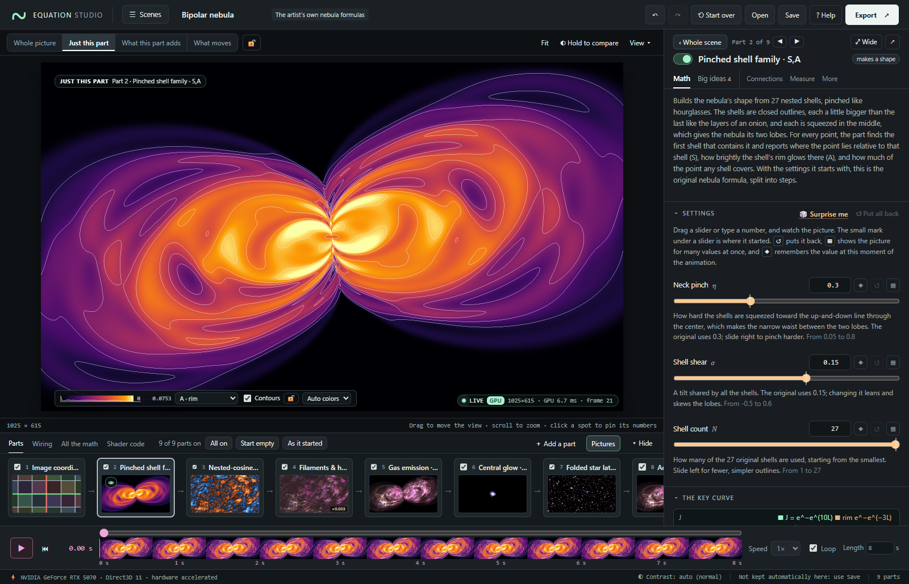

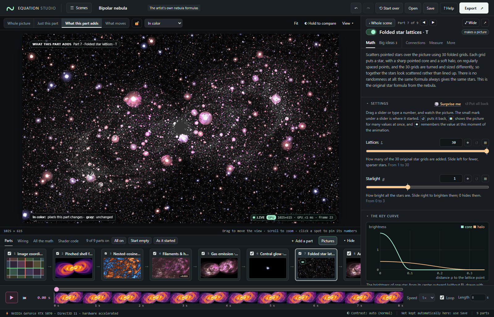

### Colors for numbers, positions and shapes

Pictures and light appear as themselves. Numbers, positions and shapes have no color of their own, so the studio picks colors from the values actually in view, and the legend at the lower left of the picture explains them:

| What the part makes | Automatic colors | Legend |
|---|---|---|
| numbers (a scalar field) | a color scale from the lowest to the highest value. When the numbers are both negative and positive, a two-sided scale: cool below zero, near-black at zero, warm above, the same on both sides. White contour lines show where the numbers cross round values, and the zero line is brighter | a color bar with the range and a histogram of the values in view |
| positions (coordinates) | the picture of a regular grid: each cell keeps its own pastel color, with gray lines at multiples of the cell size, red where q_x = 0 and green where q_y = 0. A warp bends the grid; polar coordinates (distance and angle around the center) turn it into rings and spokes | the cell size |
| a shape (geometry) | one of its three values as numbers: S (the position along the shells), A (how brightly the rim glows) or coverage; or all three at once in red, green and blue | a menu to choose |
| a picture (a color layer) | as it is, unless it is almost all white or all black at the scene’s brightness. Then its brightness is adjusted so you can see its structure | the factor, e.g. *×0.033 exposure* |

The legend’s controls choose the channel, the contour lines, the automatic brightness and **Classic** colors (the fixed colors of version 1.x: gray = ½ + ½·tanh(value); red/green = ½ + ½ sin of the coordinates; red rim, green coverage, blue warp). Its **🔓** keeps the current color range, so you can change a setting and compare colors fairly. On a narrow picture the controls fold behind **⚙**. The readings and **Measure along a line** give the exact numbers behind any color.

### Rulers, grid and readings

**Rulers** (`R`) and **Grid** (`G`) are in the **View ▾** menu and are off until you switch them on. The rulers show positions along the edges of the picture, with ticks every 1, 2 or 5 units (or a tenth or ten times that) to suit the zoom; the top-right corner shows the size of a big tick. With the rulers on, a crosshair follows the pointer and shows its position, the pixel, the color there and the **actual value** made by the part on the picture (in *Just this part*) or by the open part (otherwise). With the rulers off, the line under the picture shows the position, pixel and color under the pointer.

**Click the picture to pin a reading**, with or without the rulers. The reading, marked PINNED, stays where you clicked, shows the value there, and updates as you edit or play. **Unpin ×** or `Esc` removes it. Alt-click shows one raw value in a message. Rulers, grid, readings and labels are never part of an export.

### Measuring along a line

**Measure along a line** (`V`, in the View menu) opens a graph under the picture. It plots the **actual numbers** made by the part on the picture along the line across the picture through the pointer, or through the pinned reading. The menu in its header switches to *Up and down (a vertical line)* or to *Over time, at one point*. A dashed line on the picture shows where it measures. Numbers give one curve, positions their x and y, shapes S, A and coverage, and pictures their red, green and blue light (before brightness and Light to color) and coverage. Below the graph are each channel’s smallest, largest and average value along the line. The graph makes the shape of a function obvious: the bump of a Gaussian ring, the step of a threshold, the zigzag of a fold, the spikes of stars.

### All the math

**All the math** writes the whole scene out as math. At the top, **the whole picture, as math**, shows how the parts that combine others (Add light, Front over back, Tint, Mask, Combine scalar fields) put the picture together, e.g.

*image = Gas emission + Central glow + Folded star lattices*

Below it comes every part in order. Each input is bound to the part that feeds it (*p ← Image coordinates · S, A ← Pinched shell family*), then come the part’s math and where what it makes goes (*→ Add light as B*). Hover a line for its explanation, and click a block to open that part.

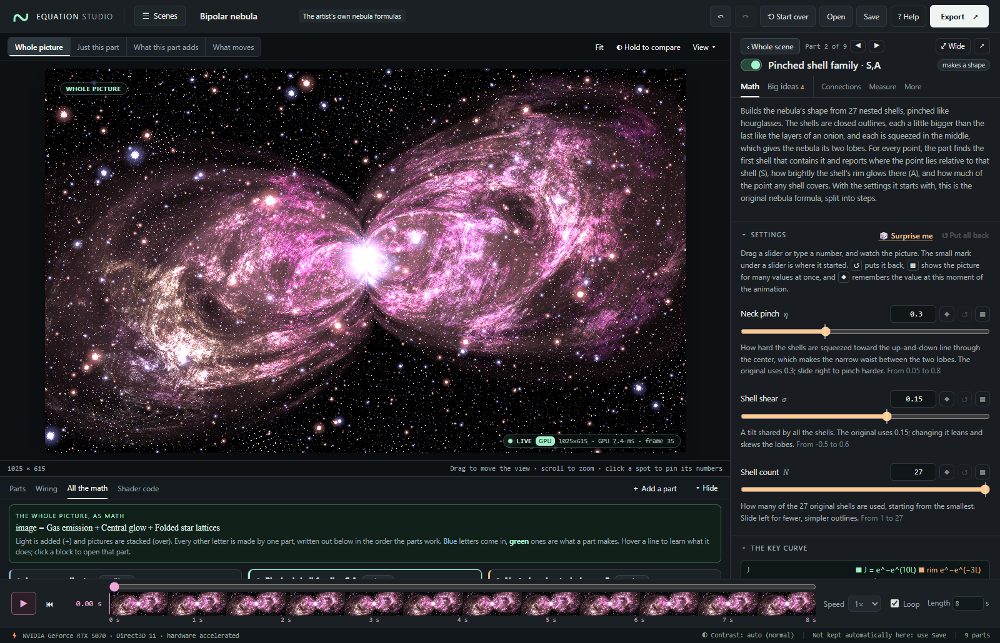

### The camera

Drag the picture to move the view. Scroll or pinch to zoom in or out around the point under the pointer. **Fit** (`F`) brings back the starting view; at 2000 × 1200 pixels it reproduces the source grid of the original nebula exactly. The camera is saved with the scene and undone like any other edit.

**Sharpness** (in the View menu) sets how many pixels the studio computes. **Auto · sharp**, the default, matches your screen, including high-density screens. While you drag, or while the animation plays, frames that take longer than about 24 ms on the GPU are drawn at a lower resolution, and the picture sharpens again when you let go. The fixed sizes draw exactly that width. Every setting computes the same math; exports choose their own size.

## The part panel

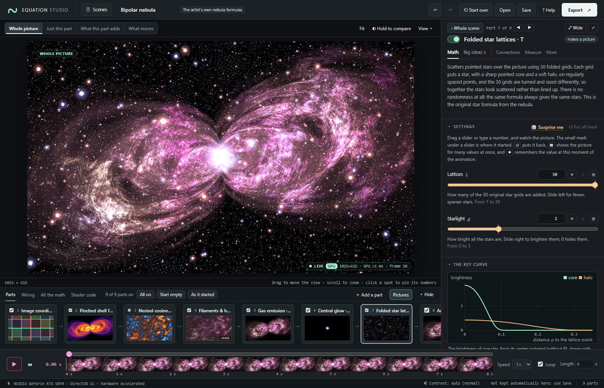

When you open a part, the side panel explains it and lets you change it. Its header stays in view while you scroll:

- **‹ Whole scene** goes back to About this scene. **Part 3 of 4** says where the part sits in the order, and ◀ ▶ (or `[` `]`) open the previous and next part. On the right, **⤢ Wide** makes the panel wide (the [wide panel](#the-wide-panel), `E`) and **↗** opens the part in [its own window](#the-pop-out-window).
- Next come the part’s on/off switch (see [Switching parts on and off](#switching-parts-on-and-off)), its name (you can rename it; only the label changes) and a chip saying what it makes: **makes a picture**, **makes numbers**, **makes a shape** or **makes positions**. Hover the chip to learn what that means.
- Then the tabs. A part made of math has **Math**, **Big ideas**, **Connections**, **Measure** and **More**. A Shader code part has **Code**, **Look inside**, **Big ideas**, **Connections**, **Measure** and **More**. The last three are for going deeper and look quieter. The panel keeps the tab you chose as you open other parts, and starts each part at its top. A small mark on a tab says there is something in it: the number of big ideas, ◆ when a setting has keyframes, ✎ an edit not applied yet, ◉ a value on the picture.

**Math** shows what the part computes, in this order:

1. A plain sentence on what the part does, and a warning if it is switched off or nothing uses it.
2. **SETTINGS**: a slider for each setting, with its letter and what it does in plain words. A hint at the top explains the small buttons next to each one: **↺** puts the setting back where it started, **▦** shows the picture for many values at once, and **◆** remembers the value at this moment of the animation (a keyframe). The small mark under a slider shows where it started. **🎲 Surprise me** and **↺ Put all back** are in the heading.
3. **THE KEY CURVE**: for a part built around one curve, a live graph of that curve with the current settings. Examples are the S-curve of a soft threshold, the profile of a ring or disc, the core and halo of one star, the twist of a vortex against distance, and the width of a tidal stream along its length.
4. **THE MATH, STEP BY STEP**: the part’s equation as numbered steps. Each step is typeset and followed by a sentence that says what the line computes and why, and the result line is marked **⇒**. A sentence above the steps explains the colors (*Reading the colors: blue letters come in from earlier parts…*). Letters that come in from earlier parts are blue, settings are orange, the time t is pink, and what the part makes is green and bold. Hover any letter to light it up everywhere, together with its setting. Click a blue letter to open the part it comes from. **Drag an orange letter sideways** to change its setting (hold Shift for small steps; one drag is one undo step). **Show numbers** puts each setting’s current number in place of its letter and keeps it up to date; **Show letters** switches back. **✎ Edit** opens the math as text: see [Editing equations](#editing-equations).
5. For an artist’s work made of dots, **AS POSTED**: the sketch exactly as the artist posted it.

**Code** and **Look inside** belong to Shader code parts: see [The Code tab](#the-code-tab) and [Look inside](#look-inside).

**Big ideas** explains why the math is written the way it is. It shows the ideas that come up again and again in pictures like this, e.g. *Folding with arccos(cos t)*, *The double-exponential gate* and *Front-to-back selection*. Each has its formula, an explanation and often a small graph with a slider to play with. Under them, *Other letters in the math* explains the part’s fixed constants and in-between values.

**Connections** shows where each input comes from and where the part’s result goes. For each input you see the part that feeds it (change it with the menu), **＋** to put a new part in between (for example a warp before a pattern), and a small picture of what comes in. For the result you see every part that uses it, the letter it goes by there, and the line of math that uses it: for example, the stars’ result *T* is used by *Add light* as *B* in RGB = A + gB. Click any of them to open it. **☆ Make it the final picture** makes this part’s result what the scene shows, saves and exports.

**Measure** measures what the part makes: see [Measuring: the Measure tab](#measuring-the-measure-tab).

**More** has three sections. **SHADER CODE** shows the shader code the part adds to the scene’s program (and, for a part that calls a library function, that function’s source). **KEYFRAMES** lists the settings that change over time: choose how each one moves between its keyframes (smooth, linear or hold), or delete keyframes and whole tracks. **THIS PART** has **Swap for…**, **Duplicate** and **Delete**.

Click a section’s heading to fold it away, and again to open it.

## The wide panel

**⤢ Wide** (`E`, or double-click any part) makes the side panel wide, for studying one part. The panel takes half the window. On a wide screen its Math tab gets two columns, with the settings and key curve on one side and the math on the other. The picture switches to *Just this part* (unless the part makes the final picture) with **Measure along a line** under it, and the parts strip shrinks to a row of names so the picture keeps its height. Nothing else moves: you still go from part to part with the strip, `[` `]` or ◀ ▶. `Esc` first brings back the whole picture and then closes the wide panel; ⤢ or `E` closes it at once.

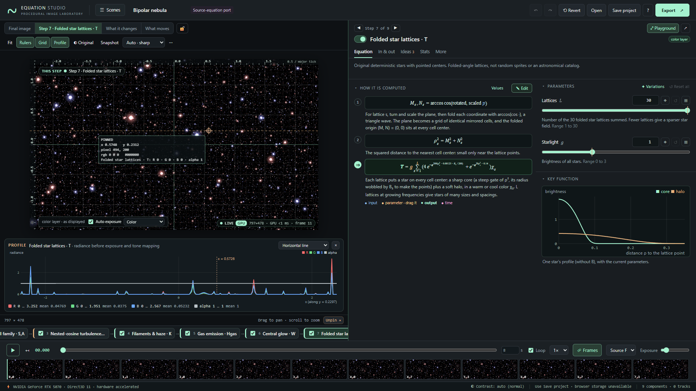

### The pop-out window

**↗** opens the panel for the open part in a separate browser window, for example on a second screen next to a full-size picture. The window follows the part you open; tick **Pin** to keep it on one part while you open others. Its controls change the scene in the main window, and `Ctrl/⌘ Z` undoes there too. The window closes with the page. If the browser blocks pop-ups, the wide panel opens instead. Phones and tablets, which open no second windows, hide ↗ and use the wide panel.

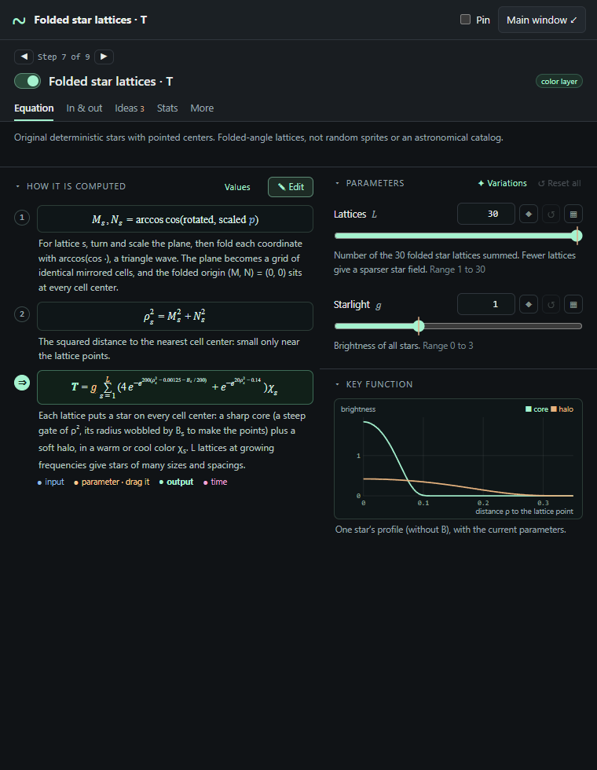

## Editing equations

Every part whose inputs are numbers or positions can be edited as math: the custom equation parts, and the built-in parts that do not read pictures or shapes. It works the same way for all of them:

1. **✎ Edit** in the heading of *The math, step by step* (or double-click the math) turns the steps into an editor. It holds the math as text, one line per step, and the panel widens to give it room. For a built-in part, the text is the part written out in the equation language, line for line with the steps you were reading. Its settings become `param` lines named after their letters (κ becomes `kappa`, c_x stays `c_x`), at their current values.
2. **Change anything.** As you type, **As math** shows the lines typeset exactly as the steps will read. The checker reports mistakes in words (*Line 3: Unknown name “raduis”. Did you mean “radius”?*; *Cannot add a vec2 and a vec3*; *The result must be a number (float), but it is a vec2*). A moment after you pause, **the picture shows your edit**, labelled **DRAFT**. The draft is kept while you look at other parts (the parts strip marks it ✎), but only the open part’s draft is shown on the picture.
3. **Apply** (`Ctrl/⌘ Enter`) puts it into the scene as one undo step; **Cancel** throws it away. Math with a mistake is not applied, and nothing else changes. A built-in part becomes your equation when you apply: it keeps its wiring, setting values and animation, and its name gets “· equation” added. Undo brings back the original.

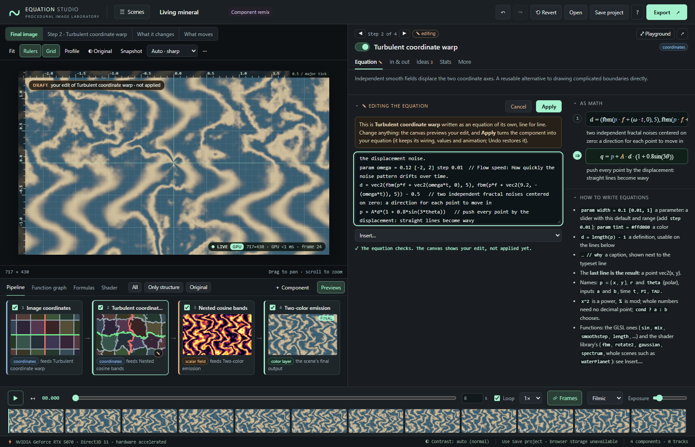

When you apply, a setting keeps its current value if its `param` line is unchanged. If you edit its default (`param bands = 14` to `= 30`), it takes the new default. Settings that no longer exist are dropped, together with their keyframes.

Parts that read a picture or a shape (tint, mask, the parts that combine others, most of the original nebula) cannot be written as math yet; their ✎ Edit is dimmed, and its tip says why. Some built-in parts are loops over many terms (the star lattices, the nebula clouds, whole scenes such as the water planet). Their math is a call of the shader-library function that runs the loop, and that function’s code is under More ▸ Shader code. You can still change what goes into it and what comes out.

### The equation language

An equation is a short program, one statement per line:

```text
// A glowing ring (lines starting with // are ignored)
param radius = 1 [0.1, 3]      // distance of the rim from the center
param width = 0.1 [0.005, 1]   // thickness of the rim
d = length(p) - radius         // signed distance to the circle
exp(-(d / width)^2)            // a Gaussian bump across it: the result
```

- `param name = value [min, max]` adds a **setting** with a slider (`step 0.01` after the range sets its step). It behaves like any other setting: put back, many values at once, keyframes, Surprise me. `param tint = #ffd080` adds a color.
- `name = expression` is a **definition**, which the following lines can use.
- The **last line is the result**: a number for a scalar equation, a pair `vec2(…)` for a coordinate equation, and a color `vec3(…)` (or `vec4(…)` with coverage) for a color equation.
- `// …` after a line is its **caption**, shown next to the typeset line in *The math, step by step*.

The names you can use are `p` = (`x`, `y`), its distance from the center `r` and its angle `theta`, the optional inputs `a` and `b`, the time `t`, and `PI` and `TAU`. You can call the GLSL built-in functions (`sin`, `mix`, `smoothstep`, `length`, `clamp`, …) and every function of the shader libraries: helpers such as `fbm`, `noise2`, `rotate2`, `gaussian`, `cutoff`, `softInside`, `spectrum`, `vortex`, `domainWarp` and `angularMirror`, and whole scene kernels such as `waterPlanet(p, 1, 0.6, 5, 2, t)` or `nebulaStars(p, 30, 1)`. The **Insert…** menu under the editor lists them with their arguments, and *How to write equations* beside it sums up the rules. Whole numbers need no decimal point. `x^2` is a power (written out as `x·x`, so it is exact for negative `x`), and `%` is `mod`. Comparisons, `&&`, `||` and `cond ? a : b` work as in GLSL. The studio checks equations and prints them again as shader code; it never pastes them in, and they cannot contain loops or JavaScript.

To start from scratch, add a **Custom scalar**, **Custom coordinate** or **Custom color** equation (＋ Add a part). Each one starts from a short example with a slider, a definition and captions.

## Animations: shader code and point clouds

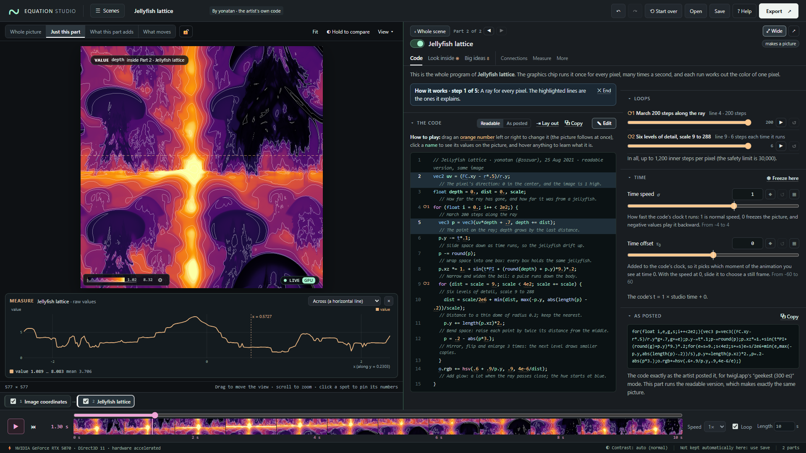

Most of the gallery is animations whose artists published their code: twigl.app shaders and p5.js sketches made of dots. Opening one shows its **About this scene**: the credit, a link to the post, what was checked (**✓ Made from the artist’s own code**, or **Our own study of the look** for the anemone, whose code was not published), its story, Try this and How it works. **Open its code ›** opens the part that holds the code: a **Shader code** part or a **Point cloud**.

### The Code tab

A Shader code part’s first tab, **Code**, starts with a sentence on what it is: the whole program, which the graphics chip runs once for every pixel. Then comes **THE CODE**, highlighted, one line per row, with **How to play** above it. Hover anything to learn what it is: the inputs (`FC`, `r`, `t`, `o`, underlined), the twigl helpers (`hsv`, `rotate2D`, …), the GLSL built-ins, and every variable (with the caption of the line that declares it). Loops are marked **⟳1**, **⟳2** in the margin. In a narrow panel, long lines wrap and each line’s caption moves under it; the wide panel (`E`) gives the code room.

- **Drag an orange number** sideways to change it (Shift for smaller steps), or click it and use the arrow keys. The picture follows at once, because numbers are live and nothing recompiles. One drag is one undo step.
- **Click a name** (a variable) to put its values on the picture instead of the color: *Just this part*, labelled **VALUE**, with a color scale and legend. `Esc` brings the color back.
- **Readable / As posted** switches between the readable version the scene opens with and the code exactly as posted. Both draw the same picture. **⇥ Lay out** rewrites a one-liner with one statement per line (without comments), and **⧉ Copy** copies the code.
- **✎ Edit** opens the code as text. The picture shows your edit (DRAFT) while the studio checks it, and a mistake names its line (*Line 3: Cannot multiply a vec3 and a int. GLSL does not turn whole numbers into floats: write 2. or 2.0*). **Apply** (`Ctrl/⌘ Enter`) puts it into the scene, and **Cancel** throws it away. *How to write code*, beside the editor, lists the inputs, helpers and rules.

While a step of How it works is open, the lines it explains are highlighted, and a banner above the code names the step (*How it works · step 2 of 5*) with **✕ End** to finish the walk-through. The steps themselves are in the scene panel: see [How it works](#how-it-works).

**LOOPS** has a slider for every loop, which stops it after that many steps. The range ends at the loop’s real length (*March 200 steps along the ray*, *6 steps each time it runs*). **▶** sweeps the loop from 0 steps to all of them in four seconds, so you can watch the picture build up (press it again or `Esc` to stop); **↺** runs it in full again.

**TIME** has the part’s own **Time speed** and **Time offset**: `t = speed × studio time + offset`. **❄ Freeze here** turns the animation into a still of the moment the time bar shows.

**SETTINGS** holds the sliders made by the code’s own `param` lines, if it has any. **AS POSTED** shows the original code, with ⧉ Copy.

### Look inside

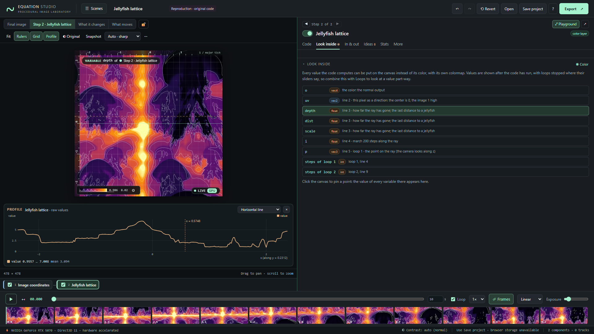

The second tab lists every value the code computes. First comes the color `o`, then each variable with its kind and the line that declares it, then the number of steps each loop took. The kinds are given in plain words: a *color*, a *number*, *2 numbers*, *3 numbers*, a *count* or *yes/no*. Click one to show it on the picture with its own color scale. A raymarcher’s `depth` becomes a depth map, its last distance shows how close each ray came to a surface, and a fractal’s `scale` shows how deep it went. Values are shown after the code has run, with loops stopped where their sliders say, so combine this with **Loops** to look at a value part of the way through. Click a point on the picture to pin it, and the value of every variable there appears next to its name.

### Point clouds

A Point cloud’s **Math** tab shows its point formula as typeset steps with captions, like any other math, with **✎ Edit**. Its settings are the number of dots, their size, color and opacity (how see-through they are), the sketch size and the time. *Just this part* shows the dots over black, and the scene puts them over a background with *Front over back*. For a p5.js work, **AS POSTED** shows the original sketch.

### Reusing an animation

**＋ Add a part** opens the Parts tab, which starts with the works. Click one to add it to the current scene as a credited picture. Then combine it with *Add light* or *Front over back*, or warp it through its input p. With **❄ Freeze here** it becomes a still. The tips in the Parts tab show every part drawn on its own.

## Measuring: the Measure tab

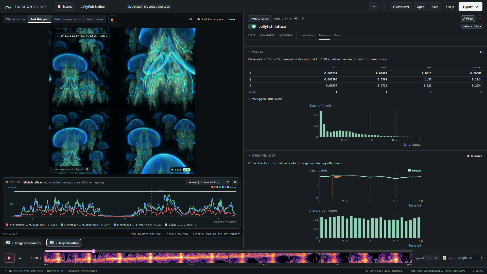

<a id="measuring-the-stats-tab"></a>Every part has a **Measure** tab:

- **VALUES**: the smallest, average and largest value and the spread of each channel of what the picture shows for this part (or of the value shown), the share of pixels that are clipped, black or not a finite number, and a histogram. It is measured at once, and again with ↻.
- **POINTS** (point clouds): how much of the picture the dots cover and how densely they pile up.
- **OVER THE LOOP** (▶ Measure): 25 frames across the animation. It shows the average brightness through time, the change between neighboring frames, and whether the loop is seamless (the end leads into the beginning like any other frame) or jumps.
- **INSIDE THE CODE** (▶ Measure, shader code): the range of every variable over the picture, and how many steps each loop really took per pixel.
- **GPU TIME** (⏱ Measure): how long each part’s view takes to draw at the size of the picture, and the part’s own share without its inputs. This shows where the time of a frame goes.

## Experimenting safely

Nothing you try is hard to take back:

- **↺ next to a setting** puts it back where it was when the scene was opened (for a part you added, its default), and removes its keyframes. Double-clicking the setting’s name does the same. Changed settings are marked with a dot, and **↺ Put all back** puts back every setting of the part.
- **◐ Hold to compare**: press and hold the button, or hold `O`, to see the scene as it was when you opened it. The label on the picture says **AS IT STARTED**.
- **⟲ Start over** brings back the whole scene as it was opened. The open part, the view and the time stay, and Undo brings your changes back.
- **Undo and redo** (**↶ ↷**, `Ctrl/⌘ Z`, `Ctrl/⌘ Shift Z`) cover every edit, including the camera, switching parts on and off, dragged letters and numbers, applied edits and Try this.
- **Snapshot** (`S`, in the View menu) bookmarks the scene and the time in **Scenes ▸ Snapshots**. Up to thirty are kept in this browser; they are not part of the saved file.

### Sweeps and Surprise me

**▦** next to a setting opens a tray under the picture, with the picture drawn at seven values across the setting’s whole range. **🎲 Surprise me** draws eight versions with the settings changed at random. The tray’s menus choose whose settings change (**This part** or **Whole scene**) and how far (**A little**, **Some** or **A lot**), and **🎲 Shuffle** makes eight new ones. Hover a small picture to see it large on the main picture (labelled **PREVIEW**), and click it to keep it; Undo takes it back. The small pictures use the current view, so a sweep while the picture shows just one part shows how that part changes.

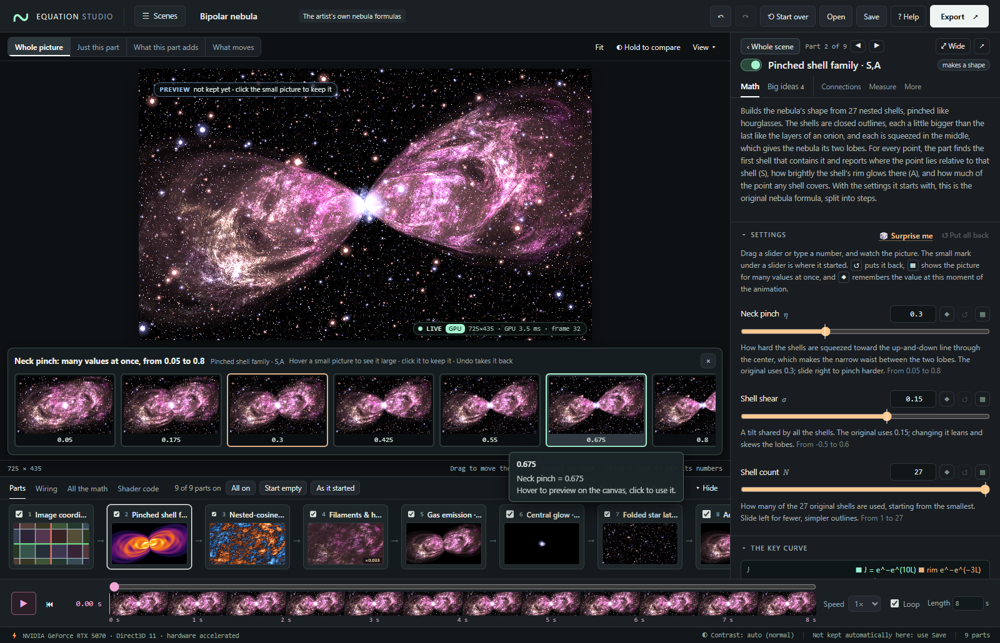

## Switching parts on and off

Every part has an on/off switch: a checkbox on its card in the parts strip and in the Wiring view, and the switch next to its name in the panel. Switching a part off makes the picture as if the part were not there (the part is *bypassed*):

- A part that **changes** what comes into it passes it through unchanged. That covers parts that move positions around (a warp, a vortex, a mirror) and parts that tint, mask or sharpen a picture (Tint, Mask, Soft threshold).
- A part that **combines** two things passes its main input: Add light passes A, Front over back the picture at the back, and Combine scalar fields a.
- A part that **draws** something (a pattern, a shape, a light, a star field) adds nothing.

The tip on each switch says exactly what that part will do when it is off. Switching a part on also switches on anything it needs. Above the parts strip, **All on** switches every part on. **Start empty** switches off every part that draws something, so you can switch them on one at a time and watch the picture build up. **As it started** brings back which parts were on when the scene was opened.

Switching parts on and off is instant: it never recompiles the shader.

## Composing

**＋ Add a part** opens the library at its **Parts** tab: every building block, with a live search. Hover an entry to see what it does, its math and a small picture of it on its own. Click it to add it: its inputs connect to the open part when the kinds match, the new part opens, and the picture shows *Just this part*. You can also drag it onto the Wiring view: onto an **input dot** (it is added and wired into that input), onto a **part card** (wired into its first input that fits) or onto the picture. Choose **⇥ Keep open** first when you want to drag several.

In the panel’s **Connections** tab, **＋ on a connected input** puts a new part in between that input and whatever feeds it. **More ▸ Swap for…** swaps the part for another that makes the same kind of thing, and keeps its connections wherever they fit. The Filament ring scene is the Bipolar nebula with its shape part swapped exactly this way.

### The Wiring view

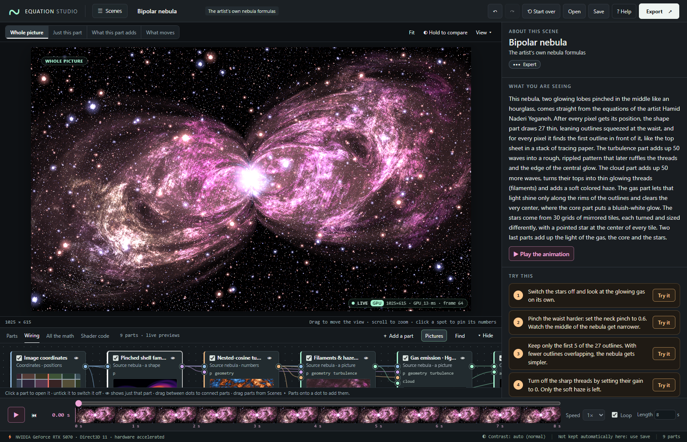

The **Wiring** tab shows how the parts are connected, laid out automatically from the first parts to the last. Cards have a colored edge and colored dots for the kind of thing they carry: blue for positions, amber for numbers, violet for a shape, green for a picture. Each card has its switch, a 👁 button that opens the part and shows it on the picture (*Just this part*), and, with **Pictures** on (`P`), a small live picture. Hover a card to dim everything that has nothing to do with it.

Drag from an output dot to an input dot to connect them (the inputs that fit light up), or click one and then the other. Drag a wire off an input to disconnect it. The studio refuses connections that would go round in a circle or mix kinds. **Find** (`L`) scrolls to the open part. While the Wiring view has focus, `Delete` removes the open part and `Ctrl/⌘ D` duplicates it.

The **Shader code** tab shows the program the graphics chip runs for the current view. Each part’s statement is labelled with its id, and its settings are named like `n3_radius`. **Copy code** copies it.

## Seeing motion

- **What moves** (`M`, above the picture) compares the picture now with the picture a tenth of a second later. Pixels that change keep their color, and still ones turn gray. The menu next to it switches from *Changing pixels* to **Trails**: the last half second at once, like a long-exposure photo.
- **Frames on the time bar** (View menu) shows twelve small pictures of the whole animation right under the time bar, in the colors of the current view. Click one to go to that moment.
- **Speed** (¼× to 2×, on the time bar) gives you slow motion for fast details.
- **Measure along a line ▸ Over time, at one point** follows one point (the pointer or the pinned reading, marked with a circle) through the whole animation, with the current time marked.

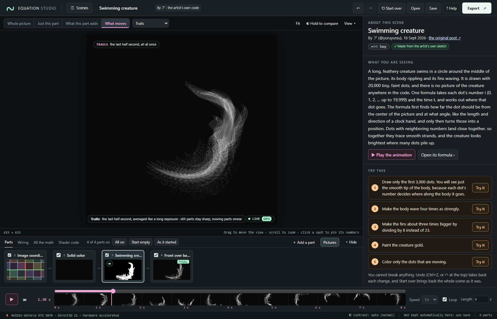

## Animation and the time bar

**▶** (or `Space`) plays and pauses, and **⏮** goes back to the start. `,` and `.` step one frame at 24 frames per second, and `Home` and `End` jump to the start and the end. The time is shown in seconds, in pink (*2.54 s*). Drag the time bar to move through the animation. The frames sit right under it, and under them a ruler marks round numbers of seconds (0 s, 5 s, 10 s…). **Speed** only changes how fast the animation plays while you watch. **Loop** starts it again at the end, and **Length** is how long it is, in seconds. Length, Loop, **Brightness** and **Light to color** (both in the View menu; *The artist’s formula*, *Soft highlights* or *Plain*) are saved with the scene.

Click **◆** next to a setting to remember its value at this moment: a keyframe. The ◆ turns pink. After that, changing the setting at another time adds or updates a keyframe there, and the setting glides between its keyframes while the animation plays. Each setting with keyframes gets a lane under the time bar. Click the lane to go to that time, click a keyframe to jump to it, and drag a keyframe to move it in time. In the part’s **More ▸ Keyframes**, choose how the setting moves between keyframes (smooth, linear or hold), or delete keyframes and tracks. Settings made by `param` lines in math or code animate the same way. See [Animation](ANIMATION.md) for the exact rules and why exports come out the same every time.

## Export

**Export** makes a still picture (PNG with the whole scene saved inside it, JPEG or WebP) or the whole animation. For an animation you can choose an MP4 with every frame at its exact time, a looping GIF or animated PNG, a sprite sheet, a PNG sequence that comes out the same every time (with the scene and a manifest), or a WebM recorded as it plays. It can also make a **web page** that plays the scene live, or the open part’s shader code for twigl.app, with its credit. When the picture shows just one part or what a part adds, a checkbox exports that view instead of the whole picture, in the colors the picture shows (a part keeps the color range it has on the picture for every frame). Details and limits are in [Animation and export](ANIMATION.md).

## High contrast

**◐ Contrast** in the footer (or `K`) cycles through *auto*, *high* and *normal*. *Auto* follows your system’s setting (prefers-contrast: more). High contrast uses a black background, white text and borders, brighter code colors and a strong yellow ring around the control that has keyboard focus. Every control stays usable with the keyboard.

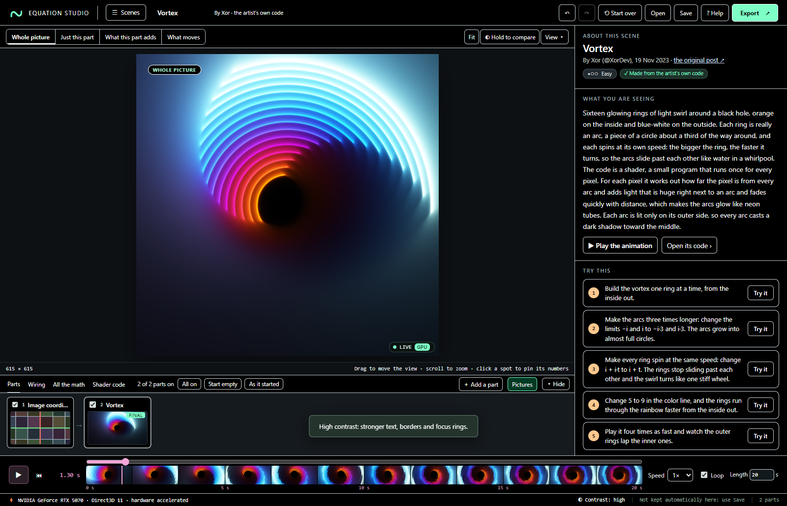

## Screens, tablets and phones

- **Wide screens**: the side panel takes about a quarter of the window, and gets two columns wherever it is wide enough (the wide panel, while editing, a wide pop-out window). Use **⇥ Keep open** if you like the library open.
- **Laptops**: the library is a drawer, so the picture gets the width it frees. The height of the parts strip adapts to the window.
- **Tablets held upright**: the picture goes across the full width, with the parts strip and the side panel side by side below it.
- **Phones**: the picture stays pinned at the top while the panel below it scrolls. The tab bar under the picture chooses what is below: **About** (the scene’s story, or the part you opened), **Parts**, **Math** (all the math) and **Wiring**. It starts on About. Part cards wrap two to a row, and the time bar stays at the bottom of the screen. Double-clicking a part (the wide panel) opens its explanation under the picture.
- **Touch**: drag to move the picture and pinch to zoom; drag the orange letters in the math like sliders; **press and hold** any control to see what it does. Controls are larger on touch screens.
- **Trackpads**: pinch to zoom, drag to move.

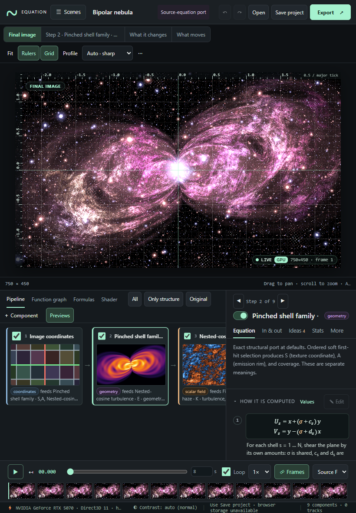

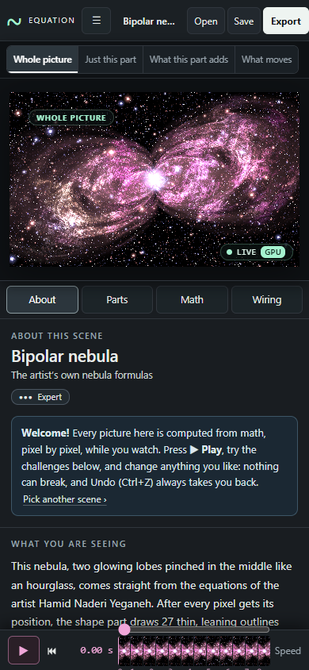 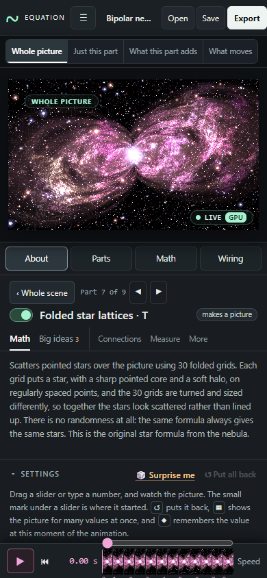

## Keyboard shortcuts

Single-key shortcuts work when no text field or dialog has focus. **? Help** lists the same keys.

| Keys | Action |
|---|---|
| `Space` | Play / pause |
| `Home` / `End` | Go to the start / end |
| `,` / `.` | One frame back / forward |
| `[` / `]` | Open the previous / next part (the picture keeps its view) |
| `I` | Just this part (press again for the whole picture) |
| `C` | What this part adds (press again for the whole picture) |
| `M` | What moves (press again for the whole picture) |
| `K` | Contrast: auto, high, normal |
| `E` | Open or close the wide panel |
| `V` | Show or hide Measure along a line |
| `Esc` | Back out one step: close the library, cancel a connection, close the tray of small pictures, stop a build-up, unpin a reading, show a code part’s color instead of a value, leave an unchanged edit, go back to the whole picture, close the wide panel |
| arrow keys on a code number | Change the number (Shift: ten times more) |
| hold `O` | Compare with the scene as it started |
| `P` | Small pictures on or off |
| `R` / `G` | Rulers / grid on or off |
| `F` | Fit: back to the starting view |
| `S` | Take a snapshot |
| `L` | Find the open part in the Wiring view |
| `Ctrl/⌘ Z`, `Ctrl/⌘ Shift Z` | Undo, redo |
| `Ctrl/⌘ S` | Save the scene as a .json file |
| `Ctrl/⌘ D` | Duplicate the open part |
| `Ctrl/⌘ Enter` | Apply the edit (math or code) |
| `Delete` / `Backspace` | Delete the open part (while the Wiring view has focus) |
| `Alt`-click the picture | The raw value at one spot, in a message |

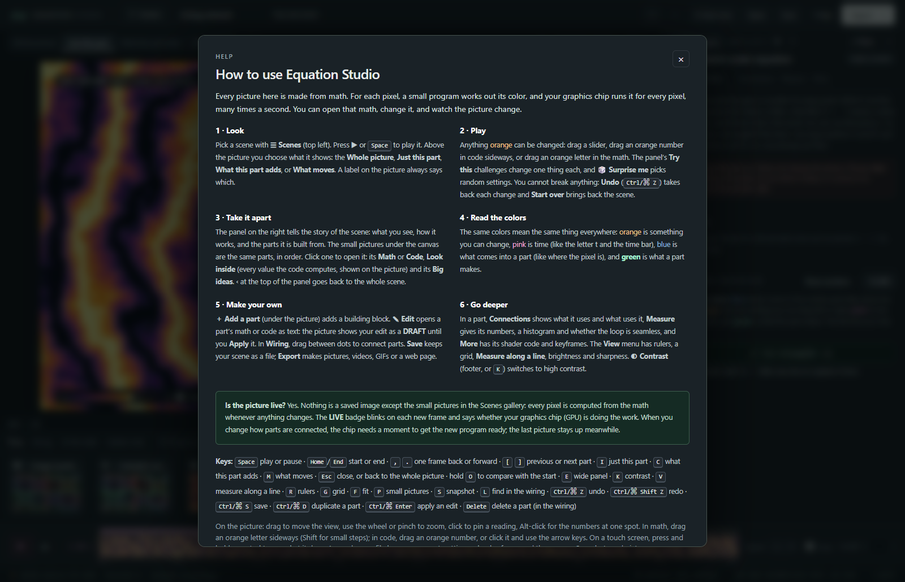

## What is remembered

Your scene is saved in this browser’s storage a moment after every edit, together with the scene as it was opened, so Hold to compare, ↺ and Start over still work after a reload. The footer says whether this works here: *Kept in this browser · nothing is uploaded*, or *Not kept automatically here: use Save*. Your preferences are stored the same way: the sharpness, rulers, grid, small pictures, Measure along a line, the colors for parts that have none, the tab under the picture, the height of the parts strip and whether it is folded away, the panel widths, the wide panel, whether the library is kept open, the contrast, the speed, the frames on the time bar, whether shader numbers are compiled as constants, and whether you have chosen a scene from the gallery (so that it stops opening by itself). Snapshots are kept there too. Edits you have not applied are not saved. Browser storage can be unavailable or cleared, so **Save** is the backup you can carry around. Pictures you compare with are never stored.
