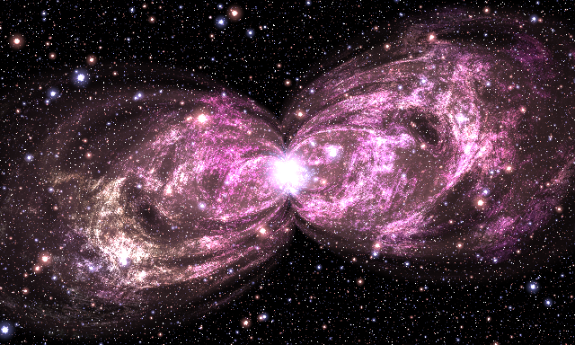
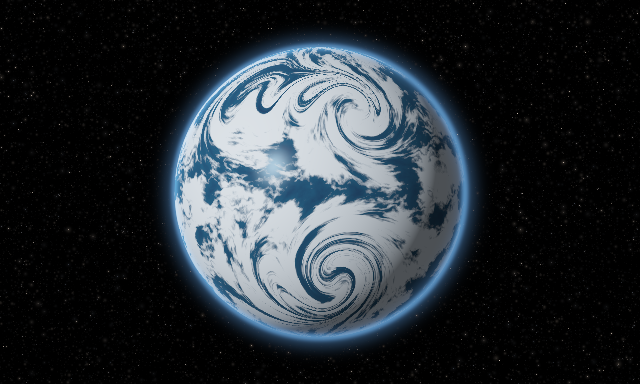
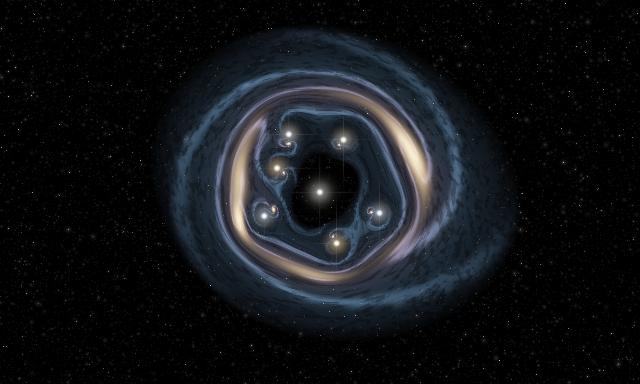
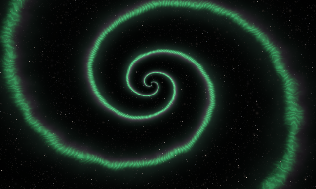
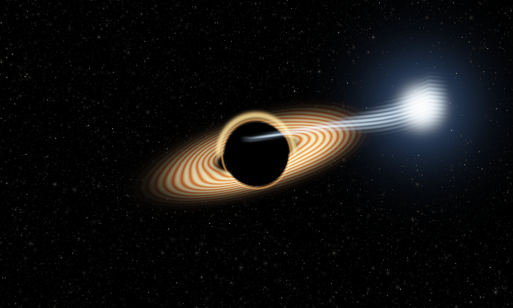
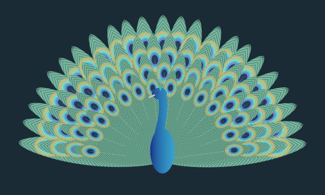
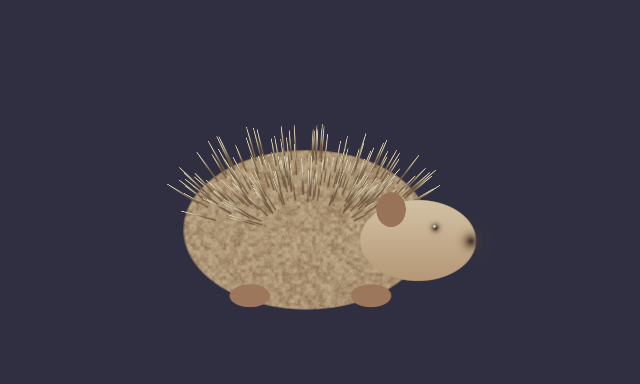
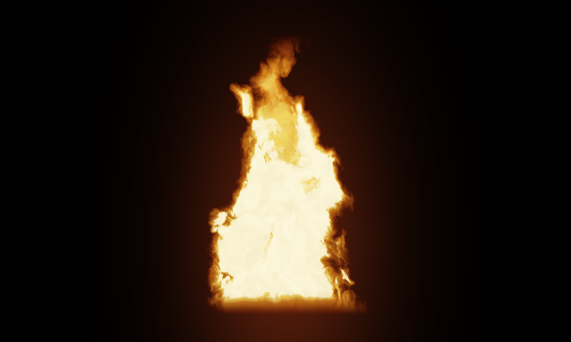

# Construction recipes: from visual intention to reusable equations

These recipes explain **the code delivered here**. Except for the original nebula, they are new, subject-based constructions, not recovered formulas from the linked posts. We did not inspect the new full-resolution formula sheets or the Hedgehog/Fire videos. See the [research ledger](RESEARCH.md) before attributing any construction to the artist.

While reading, keep the app open with **Previews** on so every component's field is visible on its card, and use **Contribution** on a component to see which output pixels it changes; the [editor guide](EDITOR_GUIDE.md) explains both. All coordinates below are local to the relevant component. Color vectors are floating-point emission values. `G(d,w)=exp(-(d/w)^2)` is a Gaussian profile. `inside(d,e)=1-smoothstep(-e,e,d)` is a soft inside mask. Neither is automatically a physical density or a true signed-distance field.

## 1. The source Bipolar Nebula



**Visual task:** two pinched, overlapping luminous lobes, irregular filaments, a bright center and a dense independent star field.

**Actual graph:**

```text
coordinates → pinched geometry ──→ turbulence ──→ cloud color
                     │                   │              │
                     └───────────────────┴──────────────→ gas
coordinates + turbulence ──────────────────────────────→ core
a separate source star field ──────────────────────────→ stars
                                                        ↓
                                         Add(Add(gas, core), stars) → F
```

A shell has radius `R_s` and sheared coordinates `U_s,V_s`. Its residual is

\[
L_s=\sqrt{U_s^2+[2R_s^{0.3}|U_s|^{-0.3}V_s]^2}-R_s.
\]

The `|U|^-0.3` factor makes off-axis displacement expensive close to the longitudinal center. Its contour pinches into two lobes. Slightly different shell radii/shears produce overlapping contours rather than one perfect symmetric balloon.

A gate `J_s=exp(-exp(25-50s))*exp(-exp(10L_s))` gives soft shell membership. Each shell receives weight

\[
w_s=J_s\prod_{u<s}(1-J_u).
\]

This is an **ordered first-hit allocation**, not an ordinary sum of memberships. The running remainder makes the earlier eligible shells consume weight first. The two important outputs are a shell-following texture coordinate `S` and a rim emission envelope `A`. The geometry does not yet emit RGB.

Turbulence `E` sums products of nested cosines over 50 scales. Its coordinates include `S`, so the detail follows the shell structure instead of resembling a rectangular texture pasted across it. The cloud color `K` combines two threshold sharpnesses over another 50 bands. A core mask `W` both suppresses gas near the center and adds central emission:

\[
H=1.1(1-W)AK+W(2,2,3)+T.
\]

The star field `T` is a separate sum of 30 rotated, folded lattices. `acos(cos(t))` periodically folds each axis into a nonnegative coordinate. Distances close to lattice intersections produce bright centers and halos; an angular modulation produces pointed fine structure. There is no stellar catalog, sampled star texture or random simulation state.

**Inspect:** isolate the geometry, then turbulence, cloud, gas, core and stars in that order. Probe the raw fields rather than interpreting their false-color diagnostics as intensity. Turn the star gain to zero to see the gas without bright point sources. Source band counts and phase parentheses are documented exactly in the [retained formula reference](../reference/nebula_rewrite/docs/FORMULA_REFERENCE.md).

**Reuse:** Ring Nebula changes only the geometry bundle:

\[
d=\sqrt{x^2+(fy)^2}-r_0,\quad S=2d,\quad A=0.22G(d,w).
\]

It reuses the original turbulence and cloud-color functions. For two independent nebulae, create two transformed coordinate branches before geometry, then add their radiance over one shared star field. Do not add two already clipped PNGs and expect the same result.

## 2. Stormy water planet



**Visual task:** a shaded sphere with exposed dark ocean, bright irregular cloud bands, spiral storm centers and a thin atmospheric rim.

**Our construction:** a disk supplies the visible silhouette. Inside it,

\[
d=p/R,\qquad z=\sqrt{\max(1-d_x^2-d_y^2,0)},\qquad n=\operatorname{normalize}(d_x,d_y,z).
\]

The normal `n` determines lighting. Latitude/longitude-like coordinates use inverse sine on this visible hemisphere. They determine where the cloud pattern is sampled. Surface coordinates and lighting normals have different jobs.

Seven localized coordinate vortices bend the surface domain. Each samples

\[
q'=c+R\!\left(k\exp[-\|q-c\|^2/a^2]\right)(q-c).
\]

Different centers, radii and signs break the appearance of a single global swirl. Applying these maps sequentially makes the resulting domain more complex while each atomic operation remains understandable. This is a kinematic texture warp, not a solution of fluid equations on a sphere.

The warped domain enters multiscale value noise. A high-frequency, noise-bent sine adds cloud striations. A soft threshold selects bright cloud regions; its threshold shifts with **Cloud cover**. The ocean color varies more gently. Their colors are mixed **before** applying ambient-plus-diffuse illumination:

\[
C=\operatorname{mix}(C_{ocean},C_{cloud},m_{cloud})
   [a+\max(n\cdot\ell,0)].
\]

A power of the reflected light direction adds a compact ocean glint only where clouds are absent. A high power of `1-z` adds a limb term. A **separate Atmosphere component** contributes one narrow and one broader Gaussian ring.

**Composition:** the planet is alpha-composited Over the background stars, so stars do not show through its dark side. The atmosphere is added afterward as emission. Keep planet and atmosphere radius controls aligned when changing size. Lighting angle and storm twist are independent controls.

**Inspect and reuse:** isolate Planet versus Atmosphere and Stars. Change cloud cover before storm twist; their effects are different. Reuse the Vortex/domain-warp atoms for smoke, marbling or a galaxy. The sphere/lighting implementation is a compound kernel in `waterPlanet`; the seven-cyclone map is a separately named reusable GLSL helper. The current graph exposes the compound planet rather than sockets for every internal cloud/light intermediate.

**Animation:** sampling coordinates drift in time; the image is not generated by numerically evolving an atmosphere. A time-dependent phase gives motion without a simulation cache. Such drift need not loop seamlessly.

## 3. Galaxy gravitationally lensed by a star cluster



**Visual task:** an extended source galaxy distorted into arcs around a visibly separate foreground cluster.

The reusable operation is a **coordinate map**, not a blur and not a collection of manually painted arc shapes. For image-plane position `theta`, the source position is

\[
\beta(\theta)=\theta-\sum_i m_i\frac{\theta-c_i}{\|\theta-c_i\|^2+\epsilon^2},
\qquad I(\theta)=I_{source}(\beta(\theta)).
\]

This implementation is dimensionless and softened; `epsilon` removes the singular point. Positions follow a deterministic golden-angle arrangement, with a stronger center and weaker satellites. At zero strength, every mass contribution vanishes and `beta=theta`; that identity is verified by a raw GPU field test. The general lens-mapping framework has a scientific foundation, but these mass values/softening/placements are our illustrative choices, not a measured cluster or the artist's source equation. See [Bartelmann and Schneider](https://arxiv.org/abs/astro-ph/9912508) for scientific background.

The source galaxy is itself reusable:

\[
\phi=m\operatorname{atan2}(y,x)-k\log(r+0.1)-\omega t,
\quad A=\left(\tfrac12+\tfrac12\cos(\phi+\delta_{noise})\right)^8.
\]

`m` controls arm count; `k` controls winding. A radial envelope limits the disk, a concentrated warm term makes the bulge, and noisy dark lanes/light knots add uneven structure. A mild projection flattens the source. A Transform **after** the lens map changes the source position relative to the lens rather than moving the foreground cluster.

The foreground star component uses the **same helper for cluster positions** but samples unwarped image-plane coordinates. Keep its count consistent with the lens count when changing them. It is drawn after the lensed source; feeding it through the lens would incorrectly make the foreground lights behave like background objects.

**Inspect:** isolate the Lens coordinate field, then the Galaxy, then the cluster. Animate lens strength from zero to a larger value while holding the source fixed. Move the source and compare the resulting arcs. Raw coordinate inspection is especially useful near a lens center.

**Reuse:** feed the lens map into a checker-like custom field, a nebula branch, typography supplied as an analytic field, or a flower silhouette. Feed the unwarped source map directly to the galaxy to obtain an ordinary spiral. No separate special-case “arc” mesh is necessary.

**Limit:** this backward map reproduces a qualitative lensing mechanism, not finite-source cosmological ray tracing, time delays, full relativistic transport, or a validated recreation of the linked artwork.

## 4. Spiral aurora / auroral vortex



**Visual task:** a luminous spiral curtain, fine radial streaks, and a softer differently colored fringe.

The central geometric expression is a logarithmic spiral phase:

\[
\phi=\theta+k\log(r+r_0)+\omega t+\delta(p,t).
\]

A constant phase approximately follows `r+r0 = exp((constant-theta)/k)`. The positive `r0` regularizes the origin; an envelope suppresses the center anyway. A Gaussian of the phase wave produces thin ribbons:

\[
B=G(\sin\phi,w)\,[1-e^{-8r}]e^{-0.7r}.
\]

Because `sin(phi)=0` at multiple phases, this creates multiple winding branches. The width is measured in **phase-wave units**, not a constant physical distance from a spiral. Widening it produces broad curtains; changing `k` changes winding instead.

Angular high-frequency modulation creates the fine rays:

\[
F=0.28+0.72\left[\tfrac12+\tfrac12\sin(175\theta+20N(p)+\omega_f t)\right]^2.
\]

Green emission multiplies the ribbon by this modulation. A slightly shifted and broadened phase profile contributes a purple fringe; a broader weak profile creates haze. They share the same large geometry rather than independently drawing unrelated spirals.

**Inspect:** set Fine rays to zero to distinguish the broad ribbon from its detail. Change winding, then width. A source centered away from `(0,0)` and slight vertical compression keep the composition from becoming a perfectly symmetric icon.

**Reuse:** the phase construction also describes spiral shells, disks, whirlpools, swirling smoke and decorative geometry. A custom scalar can expose the ribbon alone; a palette can replace emission colors. A radial envelope prevents detail from extending across the whole canvas.

**Limit:** colors and streaks are design terms. There are no charged particles, field-line integration, emission spectra or magnetohydrodynamics in this study.

## 5. Black hole stretching a star



**Visual task:** a dark central silhouette, a flattened bright disk and a luminous star feeding a narrow curved stream.

The disk is an annulus measured in compressed coordinates. Its visible radial emission is a Gaussian around a selected radius, cut off near the hole. Nested radial/angular sine terms create a moving striped texture. A cosine-dependent side weighting makes one side brighter; it is an artistic cue, not a computed Doppler transfer factor despite the shader's local variable name. An explicit bent rear arc adds the recognizable elevated-rim silhouette. The shadow is independently applied to the background so unrelated stars do not remain visible through the black center.

The stream uses a parameter `u` increasing from the disk toward the star:

\[
y_c(u,t)=0.14+0.40u^2+0.05\sin(5u-\omega t),
\qquad w(u)=\operatorname{mix}(w_{thin},w_{star},u^a).
\]

Its transverse brightness is `G(y-yc,w)`, limited by a longitudinal window. Increasing the taper exponent keeps most of the stream narrow while letting it broaden near the star. A high-frequency transverse phase supplies filaments, and a separate bright Gaussian plus halo defines the surviving star.

**Composition:** Disk and Tidal stream are independent radiance layers, and background occlusion is independent coverage. This prevents a texture change from accidentally changing the shadow geometry. Transforms can move each branch, though keeping the visual stream/disk attachment coherent remains an authoring responsibility.

**Inspect:** isolate the stream and adjust star width versus taper power. Isolate the disk and change projection flattening. Turn time speed to zero for a static composition. Examine the independent shadow mask rather than interpreting a black region as zero geometry everywhere.

**Reuse:** remove the disk and transform the stream into a comet-like tail; use a cooler/hotter tint for a plasma filament; replace its centerline in source to construct a curved jet or a luminous ribbon. The named centerline, transverse profile and longitudinal window are the useful conceptual parts.

**Limit:** the scene is not a simulation of a tidal-disruption event, null geodesics, Schwarzschild/Kerr geometry, hydrodynamic accretion or spectral redshift. An illustrative arc is not evidence of computed relativity.

## 6. Peacock in full display



**Visual task:** a readable bird silhouette in front of a dense, organized but nonuniform fan of eyespot feathers.

Start with **one reusable feather**, whose local coordinates have the base at `(0,0)` and tip at `(0,1)`. Its tapered half-width is

\[
w(v)=w_0\,[\max(\sin(\pi v),0)]^{0.55}.
\]

A soft `abs(x)-w(v)` test gives coverage, with endpoint windows preventing the sinusoid from repeating beyond the feather. An oblique wave `cos(250(v+1.3|x|))` creates left/right barbs. The absolute value flips their slope across the shaft.

The eyespot uses an elliptical radial coordinate centered near the tip:

\[
e=\sqrt{[x/(0.76w_0s)]^2+[(v-0.79)/(0.107s)]^2}.
\]

Nested smooth thresholds on `e` create the bronze rim, turquoise band, blue ring and dark pupil. These are layers of analytic color, not a photographic feather. A thin centerline supplies the shaft.

The fan stamps the **same `feather()` kernel** in four outer-to-inner rows. Each row has different length and count (23, 20, 17, 14), with angles spread across an arc. Local coordinates are obtained by translating from a common base, rotating and dividing by feather length. A small position-dependent bend and per-feather time phase add variation. Over composition establishes the occlusion order. This is useful repetition: the expensive design is in the feather function, not dozens of unrelated copies.

The body/head/neck/crest are a separate silhouette built from ellipses, a narrow curved strip and short segments. They are composited in front of the fan, so the fan's geometry can change without deforming the bird.

**Inspect:** open **One Feather** first. Change eyespot size, width and time. Then open Peacock and reduce row count to one. Restore rows and adjust spread. This makes the elemental stamp, repetition rule and occlusion order visible separately.

**Reuse:** feed a Transform into the single feather and combine several instances with Over. Replace its stamp with a leaf or petal while retaining the repetition logic in a new kernel. Create rosettes, radial scales, fans and patterned surfaces by changing only the placement rule. The fan's repeated calls really use the same feather implementation as the standalone scene.

**Limit:** the shapes and colors are a new design, not the unretrieved 2026 peacock formula. Optical iridescence is represented by a chosen palette rather than wavelength-dependent microstructure.

## 7. Hedgehog and Fire teaching studies



**Hedgehog:** an elliptical body supplies a stable recognizable mass. Deterministically varied radial/segment quills supply dense repeated detail. Facial masks and small feet provide scale and orientation cues. Changing quill length/density does not replace the whole animal. The general recipe is “simple low-frequency silhouette + repeated oriented surface element + a few high-information landmarks.” It transfers to seed pods, brushes, furry surfaces or spiny plants. A subtle time term modulates the body/quills without a simulation history.



**Fire:** first define a widening base and taper with height. Advect a noise domain upward by evaluating it at `(x,y-vt)`; this transports the appearance without storing previous frames. Domain warping and thresholding cut the envelope into tongues. A hotter/brighter interior and darker red outer field create depth cues. A second, finer field introduces wisps. Height, width, turbulence and rise speed have independent roles. This transfers to smoke, mist, magical flames or jets after changing the envelope and color mapping.

These are **our own scenario-based teaching constructions**. The linked announcement captions establish that the artist posted Hedgehog and Fire explanatory videos; they do not establish that these are the steps from those videos.

## 8. Compose something not in the gallery

**Marble:** Coordinates → Domain warp → Nested cosine bands → Two-color emission. The coordinate warp makes simple waves look like veins; the palette is independent. This scene is intentionally simpler than the astronomical kernels and is a good place to start authoring.

**Kaleidoscope:** Coordinates → Angular mirror → Domain warp → Custom scalar → Custom color. Reflection supplies symmetry; a field supplies local complexity; the color function supplies a palette. This separates symmetry from detail and appearance.

**Nebular ring with stars from another recipe:** start with Ring Nebula; replace the source star-field node by the Scatter stars component. Keep its input on the original world coordinates rather than the ring's geometry warp, unless distorted stars are intentional.

**A lens applied to a nebula:** insert the Lens coordinate component before the source nebula's coordinate-dependent branches. The lens must feed geometry, turbulence, cloud, core and any *background* stars consistently. Keep optional foreground lens lights outside that transformed branch. Connecting the lens only to geometry creates a different artistic effect: the silhouette bends but fine patterns remain anchored to the original coordinate domain.

**A new flower:** build a Custom scalar `inside`-style mask from `r-(0.8+0.2*cos(5.0*theta))`, feed it into a Palette, and use a rotated or vortex-mapped coordinate field. Use Over if the mask should hide a background; Add if you deliberately want glowing emission.

The common method is to decide **what quantity each expression controls** before combining it. A spatial map changes where a field is sampled; a mask changes coverage; an emission profile changes brightness; a palette changes color; and an output curve changes displayed values. Keeping these roles explicit makes a small library capable of a large family of images.
