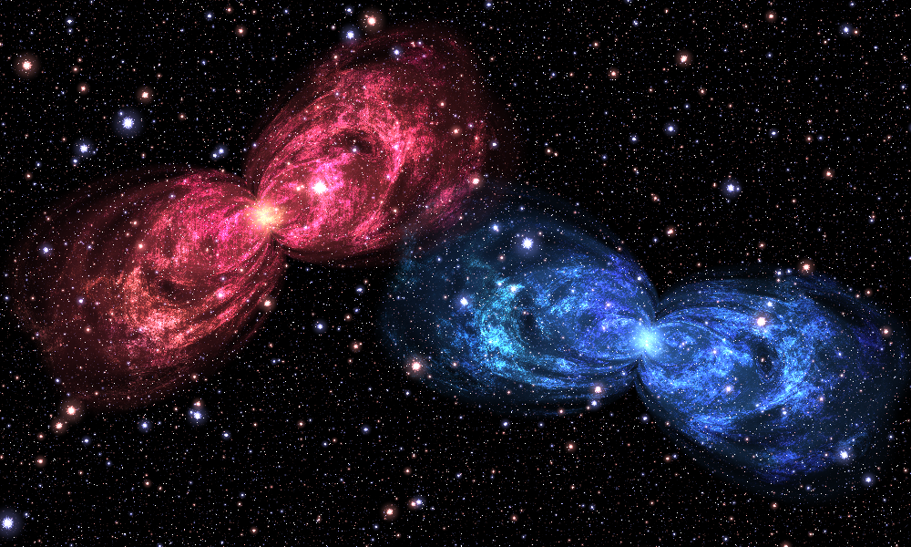
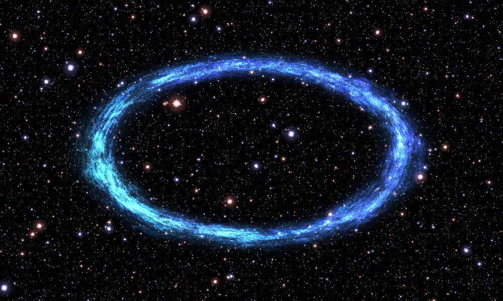

# Reuse the parts and create new structures

The renderer samples any function of the form `shader(x,y) -> RGB radiance`. The nebula is one such function, not a special case hardwired into PNG output.

Run examples from the extracted project root using `python -m examples.NAME`. Every composition below works on floating-point fields. Keep the display conversion at the end.

## 1. Reuse the star field by itself

```python
from nebula import build_starfield, render, save_png

save_png(
    "output/just_stars.png",
    render(build_starfield, width=1000, height=600),
)
```

It has no dependency on shell geometry or cloud calculations. Configure it separately when necessary:

```python
from nebula import StarConfig, build_starfield, render, save_png

stars = StarConfig(bands=18, frequency_ratio=1.18)
save_png(
    "output/fewer_star_bands.png",
    render(lambda x, y: build_starfield(x, y, stars), width=1000, height=600),
)
```

`bands` counts entire lattices, not individual stars. Removing fine bands changes the density/size distribution. It is not a quality knob that preserves the same field.

## 2. Change material/color without changing the structure

```python
from dataclasses import replace
from nebula import SceneConfig, evaluate_scene, render, save_png

settings = replace(
    SceneConfig(),
    gas_tint=(0.35, 1.05, 1.7),
    core_color=(1.3, 2.1, 3.5),
    star_gain=0.5,
)

save_png(
    "output/blue.png",
    render(lambda x, y: evaluate_scene(x, y, settings).composite(), width=1000, height=600),
)
```

The tint multiplies the original RGB cloud detail; it does not replace all the band's colors with one uniform color. A completely new palette can instead replace `filament_color` or map a scalar measure of `cloud_color` through your own color function.

A monochrome cloud is straightforward: after `evaluate_nebula`, take the RGB mean as a scalar field and `colorize` it. That is deliberately a new material, not a faithful source reconstruction.

## 3. Place more than one nebula

The complete runnable example is [examples/twin_nebulae.py](../examples/twin_nebulae.py):

```bash
python -m examples.twin_nebulae --width 1000 --output output/twins.png
```



The important assembly is:

```python
left_x, left_y = transform_coordinates(
    x, y, center=(-1.0, 0.3), angle=0.35, scale=0.52
)
right_x, right_y = transform_coordinates(
    x, y, center=(1.0, -0.35), angle=-0.45, scale=0.52
)
left = evaluate_nebula(left_x, left_y, warm_settings)
right = evaluate_nebula(right_x, right_y, cool_settings)
stars = build_starfield(x, y)

return add_emission(left.gas, left.core, right.gas, right.core, stars)
```

`center` is in world coordinates. `angle` is in radians; positive angles rotate the object counterclockwise. `scale>1` enlarges the object. These operations inverse-transform the sampling coordinates, so the procedural detail is regenerated at the new location rather than stretching an existing bitmap.

The star field is generated once in scene coordinates. Calling the full `evaluate_scene` for each object would also stamp transformed copies of its background stars; that is a different visual effect and often an accidental one.

The example applies intensity gains to avoid saturating the overlap excessively. Additive compositing makes overlapping emission brighter; it does not model one opaque object blocking another.

## 4. Replace the geometry, retain the cloud shader

The cloud shader needs a texture-coordinate field `warp` and an emission envelope `rim`. It does not require circles, lobes, or a particular number of shells. Supply a `GeometryFields` object to replace the entire original shape generator.

The complete example [examples/custom_ring.py](../examples/custom_ring.py) builds an elliptical ring:

```python
def ring_geometry(x, y):
    radius = np.hypot(x / 1.45, y / 0.82)
    residual = radius - 1.0
    rim = 0.25 * np.exp(-(residual / 0.12) ** 2)
    return GeometryFields(
        warp=2.0 * residual,
        rim=rim,
        coverage=soft_cutoff(20.0 * residual),
    )
```

Then:

```python
ring = evaluate_nebula(x, y, settings, geometry=ring_geometry(x, y))
return add_emission(ring.gas, 0.65 * build_starfield(x, y))
```



The fields must be finite NumPy arrays with the same shape as the broadcast `x,y` arrays. In the source, `rim` usually ranges between 0 and 1/4. Beginning with that scale avoids an unexpectedly overbright result. `coverage` is only diagnostic, but is still supplied so the interface can be inspected consistently.

The ring example disables core emission. The `W`-based gas cutout is still present in `evaluate_nebula`; it is negligible at the ring's radius. To remove or reposition that cutout for a different custom shape, explicitly assemble gas from the returned `cloud_color` and your envelope rather than using `ring.gas`.

### Useful alternative geometry contracts

A band around a curve can use `warp` equal to its signed residual and `rim` equal to a narrow Gaussian around zero. A set of arcs can multiply that rim by angular windows. A spiral can use a wrapped angle/radius relation as its residual, with care at the angular branch cut. A soft filled shape can supply a broad mask rather than a hollow rim.

These suggestions describe new procedural designs. `shell_residual` and ellipse residuals are not generally true Euclidean distances, so a constant residual width need not produce constant visual thickness everywhere.

## 5. Reuse a single shell as a simpler motif

```python
import numpy as np
from nebula import shell_residual, render, save_png
from nebula.composition import colorize


def shader(x, y):
    residual = shell_residual(x, y, index=12)
    # exp(-infinity) = 0 on the explicitly extended singular contour.
    rim = np.exp(-(residual / 0.035) ** 2)
    return colorize(rim, (1.0, 0.4, 0.8))

save_png("output/one_shell.png", render(shader, width=1000, height=600))
```

This isolates geometry from the expensive cloud machinery and is a useful way to understand `pinch_power`, shears, and shell size. The original scene uses ordered combinations of 27 such residuals; this example draws just one.

## 6. Practical artistic controls

| Setting | What it changes | Caveat |
|---|---|---|
| `shells.pinch_power` | Narrowing around the shell's longitudinal zero line | Lowering it toward zero removes the characteristic pinch |
| `shells.cross_scale` | Width of the transverse coordinate before the residual | Larger values generally make the lobes narrower |
| `shells.radius_step` | Shell-size progression | Also changes how the shells intersect and overlap |
| `shells.shear`, `shear_wobble` | Overall and shell-varying slant/deformation | Separate from a rigid whole-object rotation |
| `shells.count` | Number of candidate shells | Late shells also have the source's `fade_center`/`fade_rate` attenuation |
| `texture.turbulence_bands` | Number of modulation scales | Alters `E`, which affects both gas and core boundary |
| `texture.filament_bands` | Number of cloud-detail scales | Also removes those bands' color contributions |
| `stars.bands` | Number of star lattices | Not a star count |
| `gas_gain`, `core_gain`, `star_gain` | Relative strength of visible layers | Large values saturate after final conversion |
| `gas_tint`, `star_tint`, `core_color` | Layer-specific RGB weights | Tinting and replacing the intrinsic palette are different operations |

Use `dataclasses.replace` to change immutable settings, including nested settings:

```python
from dataclasses import replace
from nebula import SceneConfig

base = SceneConfig()
new_shells = replace(base.shells, pinch_power=0.18, cross_scale=1.4)
wide = replace(base, shells=new_shells)
```

## 7. Export fields for another pipeline

```bash
python -m nebula atlas --output-dir output/atlas --width 1000 --save-fields
```

```python
import numpy as np
from nebula import save_png, to_rgb8

with np.load("output/atlas/fields.npz") as fields:
    gas = fields["gas"]
    stars = fields["stars"]
    altered = 0.7 * gas * (0.5, 1.0, 1.5) + 0.8 * stars

save_png("output/recolored.png", to_rgb8(altered))
```

The NPZ contains raw float64 fields. The diagnostic PNGs are normalized for human inspection and are not interchangeable with those arrays. Cached fields allow fast recoloring and layer assembly at the cached resolution. Changes to geometry or spatial texture parameters require recomputing the relevant fields.

## 8. Porting and extension boundaries

The numerical modules are pointwise array operations with finite loops and no I/O. They can be translated to another array backend or a fragment/compute shader. Preserve the coordinate convention, radians, double-exponential gates, ordered prefix weights, and phase grouping first; optimize after checking images and intermediate fields.

A float32 GPU port may show different fine detail because the highest-frequency trigonometric phases amplify coordinate rounding. Reducing band counts, using fast approximations to trigonometric functions, or replacing `acos(cos(t))` with a modulo-based triangle wave are explicit numerical/artistic changes, not automatically pixel-preserving refactors.

This package provides 2-D scalar/RGB fields, not a volumetric nebula or an interactively rotatable 3-D object. A three-dimensional version would require a new spatial model. Simply interpreting `L_s` as a distance field for sphere tracing would be incorrect.
