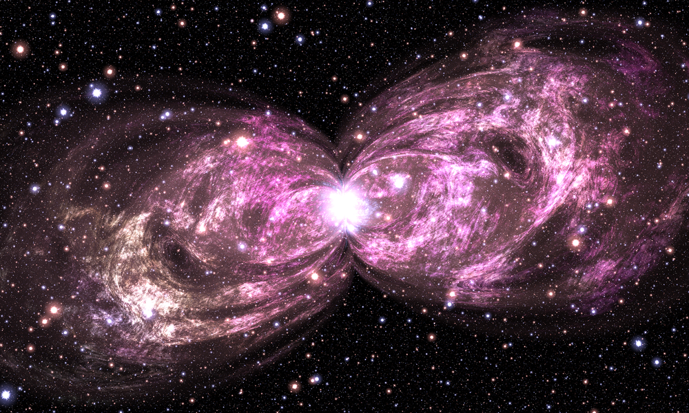
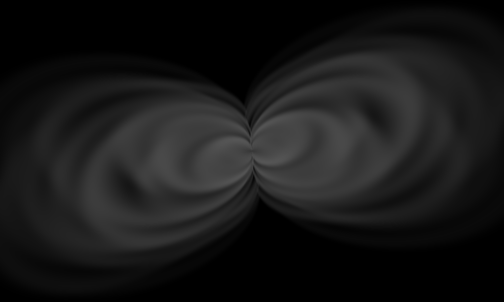
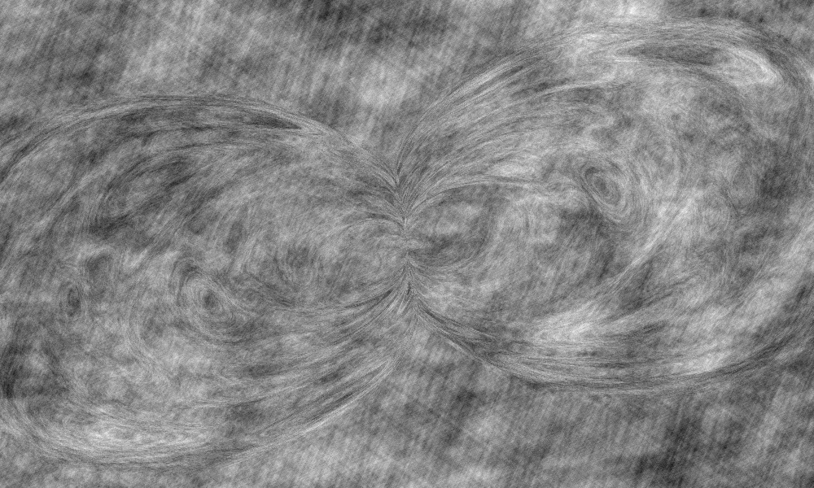
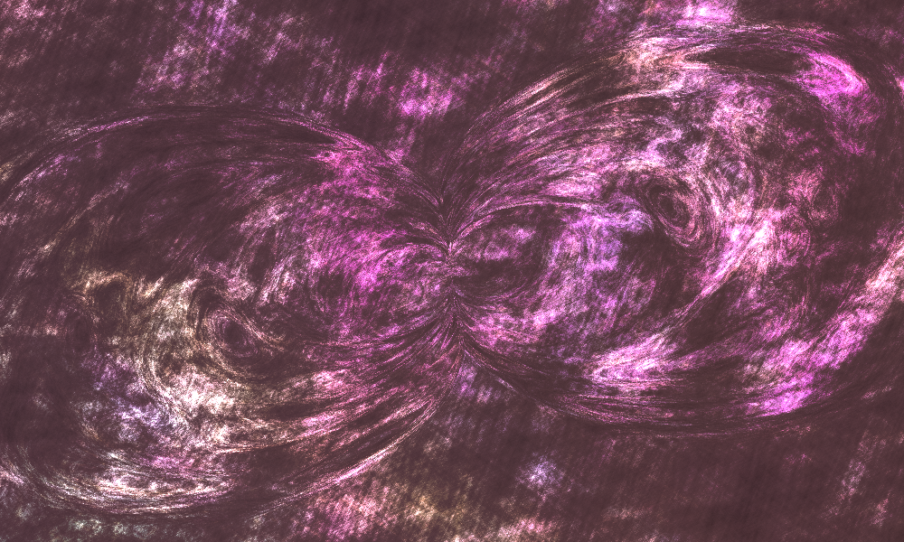
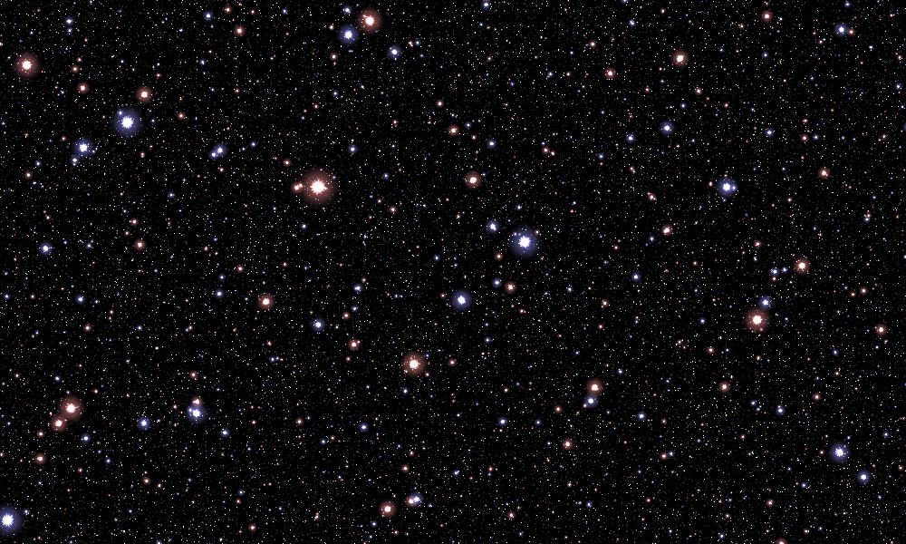

# How the equations produce the image

## 1. Think of a little program running at every pixel

The source image is not a picture encoded in a giant polynomial. It is a compact **procedural image generator**: choose a pixel, turn its column and row into coordinates, evaluate several scalar fields there, combine their contributions into red/green/blue brightness, and convert those numbers into a displayed pixel.

Every pixel can be evaluated independently. The loops are sums over different shapes or texture scales, not time steps. There is no changing simulation state and no dependency on previously rendered pixels. This independence is why the implementation can evaluate a whole image tile with NumPy arrays and why changing tile size does not change the rendered pixels.

The outermost expression becomes:

```python
gas = 1.1 * (1 - core_mask)[..., None] * cloud_color * rim[..., None]
core = core_mask[..., None] * (2, 2, 3)
radiance = gas + core + stars
pixels = to_rgb8(radiance)
```

The `[..., None]` adds a one-element channel axis, allowing a scalar mask to multiply all three RGB channels. This is NumPy broadcasting, not another artistic effect.



## 2. The dependency graph

```text
pixel column/row
      │
      ▼
world coordinates x,y
      ├──────────────────────────────────────────────┐
      │                                              │
      ▼                                              ▼
27 warped shells L_s                          rotated/folded lattices M_s,N_s
      │                                              │
soft membership J_s                           angular center modulation B_s
      │                                              │
ordered selection weights                     bright centers + soft halos
      │                                              │
      ├── S: texture coordinate warp                 └── T: RGB stars
      └── A: glowing rim envelope
              │
      S,x,y ──┴──► D_s ─► E: turbulent modulation
                              │
              S,A,E,x,y ──────┼──► C_a,s ─► I_s ─► K: RGB cloud detail
                              │
                    x,y,E ────┴──► W: central-glow mask
                                         │
                1.1*(1-W)*K*A ────────────┼──► gas
                                W*(2,2,3) ───► core

                          gas + core + stars = H
                                      │
                                      ▼
                            source display conversion F
```

**Important distinction:** `S`, `A`, `E`, and `W` are not four more images to add to the result. They are intermediate fields that control where light appears and how it is patterned. The actual additive contributions are gas, core, and stars.

## 3. Coordinates: put the origin near the bright center

The source specifies 2000 columns and 1200 rows, both numbered from **1**:

```python
x = (column - 1000) / 420
y = (601 - row) / 420
```

One world-space unit is 420 source pixels. Increasing `x` goes right; increasing `y` goes up. Because of the one-based indexing, the geometric center of the sampled rectangle is `(0.5/420, 0.5/420)`, not exactly `(0,0)`. The rewrite preserves that small offset rather than silently recentring the artwork.

At the native size, the pixel in column 1000, row 601 samples `(0,0)`. At other sizes, the renderer samples the same rectangle at the new pixel centers. It does not simply throw away the last columns and rows of the native grid.

`sample_coordinates` owns this convention. To place a structure somewhere else, transform the coordinates passed to that structure; do not edit pixel indexing throughout the shader.

## 4. One recurring primitive: a decreasing soft gate

Many intimidating nested exponentials are instances of the same function:

```python
def soft_cutoff(z):
    return exp(-exp(z))
```

Its values explain most of the construction:

| Input `z` | Approximate output | Practical interpretation |
|---:|---:|---|
| −3 | 0.951 | Mostly present |
| −1 | 0.692 | Partly present |
| 0 | 0.368 | Boundary region; not 0.5 |
| 1 | 0.066 | Mostly removed |
| 3 | 0.00000000189 | Effectively absent |

Applying it to a signed shape residual produces a smooth inside/outside membership. Applying it to a radial function produces a bright spot. Negating its input flips the sense of the transition. Multiplying its input by a larger positive number sharpens that transition.

The implementation safely computes the nested exponentials. A literal `exp(exp(z))` can overflow even when the final, intended result is simply zero.

## 5. The lobes start as a family of pinched shells

**Code:** `geometry.shell_residual`, `geometry.build_geometry`.

Each shell index `s` chooses a size and two slightly different coordinate shears:

```python
radius = 0.1 * s + 0.06 * cos(5*s*s)
u = x + (0.15 + 0.2*cos(3*s*s)) * y + 0.0001
v = y - (0.15 + 0.2*cos(4*s*s)) * x
transverse = 2 * radius**0.3 * v / abs(u)**0.3
residual = hypot(u, transverse) - radius
```

An ordinary circle would use `hypot(u,v)-radius`. Here, the transverse coordinate is divided by `abs(u)**0.3`. Near `u=0`, a small transverse displacement becomes large. The acceptable transverse width therefore narrows near that line. Farther from it, the shape opens out into two lobes.

The two shears orient and deform the result. The trigonometric terms vary those shears and radii from shell to shell, so the 27 shells do not simply look like evenly scaled copies. The small offset is present in the original formula; it is not a generic numerical epsilon added by this rewrite.

`residual`, the source's `L_s`, is negative inside a shell, zero on its contour, and positive outside. It is **not a true Euclidean signed-distance function in the original image plane**. That distinction matters if you reuse it for edge thickness, collision detection, or sphere tracing.

### Why the shells do not simply pile up

Each shell has a soft membership `J_s`. Its effective weight is:

```python
weight_s = membership_s * product(1 - previous_memberships)
```

This is an ordered “first available shell” rule. A shell contributes where earlier shells have not already taken most of the weight. The implementation keeps a running remainder:

```python
remaining = 1
for shell in shells:
    weight = remaining * membership(shell)
    # Use weight for this shell's contributions.
    remaining *= 1 - membership(shell)
```

This changes repeated prefix products from quadratic work to a linear pass. It does not replace soft boundaries with hard decisions.

### The two useful outputs: `S` and `A`

`S`, named **warp**, accumulates weighted shell residuals. It becomes a texture coordinate. Instead of drawing all texture in ordinary `x,y`, later functions partially express it in terms of the shells. That makes the texture bend with the underlying structure.

`A`, named **rim**, accumulates a hollow-shell envelope. Membership suppresses the exterior; an additional gate suppresses the deep interior; another factor fades later shells. Their product concentrates emission near shell boundaries. `A` is bounded by 1/4 for the default construction; it is not a conventional opacity mask already normalized to 1.



The separate `coverage` field in the code is a diagnostic. Replacing `A` with coverage would fill the lobes rather than retaining their glowing rims.

## 6. Turbulence bends regular patterns into irregular detail

**Code:** `textures.turbulence_band`, `textures.build_turbulence`.

The basic pattern for each band is a product of two cosine waves. Left alone, that would look regular and artificial. Inner cosines bend the phases of the outer waves, and each band uses a different orientation and phase recipe.

The frequencies increase geometrically by a factor of **1.25** from one band to the next, while their weights decrease by **0.95**. The 50-band sum is the source's `E`. Large scales contribute broad variation; finer scales add increasingly small structures. There is no random sampling: identical coordinates and settings give the same pattern.

The function is “turbulence” in a visual, procedural-texture sense. It is not a numerical solution of fluid equations and should not be presented as one.



### A parenthesis changes the artwork

In the printed `D_s`, the offset `2*cos(17*s)` belongs **inside** the main frequency multiplication. The offset `2*cos(5*s)` belongs **outside** the bending cosine. The second phase has the corresponding `15*s` and `7*s` offsets.

```python
phase_u = frequency * (direction_u + 2*cos(17*s))
phase_u += 4*cos(frequency * bend_direction_u)
phase_u += 2*cos(5*s)
```

These placements are easy to misread in the compact image and are not interchangeable. They are explicitly named/commented in the rewritten code. A visual comparison against the supplied image caught an early misplaced-parenthesis transcription; the delivered source and its independent reference both contain the corrected grouping.

## 7. Filaments add detail; per-band coefficients add color

**Code:** `textures.filament_intensity`, `textures.filament_color`, `textures.build_cloud_color`.

A second family of multiscale cosine patterns has frequencies proportional to **1.15^s**. These patterns use the shell warp `S` and a rotated coordinate `Q_s`, so they are neither a flat texture pasted over the whole frame nor copies of the star grid.

The cell pattern is shifted by the shell envelope and turbulence:

```python
threshold = cosine_cells - 1.25 + 2*rim + turbulence/7
sharp_filaments = soft_cutoff(-4.0 * threshold)
soft_haze = soft_cutoff(-0.25 * threshold)
intensity = 45*sharp_filaments + 6*soft_haze
```

This is the source's `I_s`. The first argument of `C` selects the threshold's sharpness. It is **not** a red, green, or blue index, even though the printed formula reuses a similar index symbol elsewhere.

For each band, `intensity` is multiplied by three different color coefficients. Those coefficients are summed over 50 bands to produce `K`, the RGB cloud field. This is the origin of the changing pink/white/other-toned detail; it is not one scalar image with a single pink tint placed over it.

A few individual blue-channel coefficients are slightly negative in the source. Clamping each coefficient to zero would change the construction. The rewrite keeps them and only performs the final output conversion after all contributions have been assembled.



At this stage, `K` exists across the frame. The rim envelope must still limit where it becomes visible gas:

```python
gas = 1.1 * (1 - W) * K * A
```

## 8. The central glow has two jobs

**Code:** `scene.evaluate_nebula`.

The source's `W` is a radial gate disturbed by the turbulence field:

```python
W = soft_cutoff(10*hypot(x, y) - 1 + E/4)
```

First, `1-W` removes some gas near the bright center. Second, `W` supplies its own emission with RGB weights `(2,2,3)`. Because the final conversion saturates large values, the strongest central regions become white even though the source channel weights are not equal.

Turning off the central-glow emission does **not** automatically undo its gas cutout. In the viewer, “core off” means “do not add the core layer”; the gas remains the original gas. To change the underlying shape of that cutout, change the core-mask parameters or the gas-envelope expression.

## 9. The stars are a different system

**Code:** `stars.star_lattice`, `stars.star_kernel`, `stars.build_starfield`.

The source uses `O(t)=acos(cos(t))` to fold any coordinate into `[0,pi]`. Think of it as repeatedly folding a ruler back on itself. It has zeros at multiples of `2*pi`.

Applying this fold to two rotated coordinates gives a lattice of locations where **both** folded values `M,N` are near zero. Those locations become star centers. Each of the 30 bands uses a different rotation, offset, and frequency; their superposition looks much less regular than an individual grid.

**Thirty bands does not mean thirty stars.** Each band generates many stars, and the higher-frequency bands generate smaller, more numerous ones.

The local radius is `M*M + N*N`. Each lattice combines a narrow bright-center kernel and a broader, dimmer halo kernel. `B_s` varies the bright center with angle, producing fine pointed/rayed detail rather than only circular blobs. Band parity alternates the color weights:

```text
odd bands:  (1.25, 0.75, 0.75)  — warmer
 even bands: (0.75, 0.75, 1.25)  — cooler
```



The star generator reads only `x,y` and star settings. It does not need `S`, `A`, `E`, or `W`. This is why you can put it behind another procedural object without bringing the nebula along.

## 10. Composition happens before display conversion

The source's final `F` is a nested-exponential approximation to clamping, followed here by floor/integer conversion. It is close to `floor(255*clip(h,0,1))`, but the rewrite evaluates the printed expression rather than making that approximation.

The sequence is:

```text
floating-point layers → sum → source F → uint8 RGB → PNG
```

Do not save individual 8-bit layers, reload them, and add them to reconstruct the original. Once a bright star or cloud has been clipped, its original brightness is lost. The HTML viewer therefore uses eight precomputed float-layer sums, not browser blending of clipped images.

There is no additional gamma correction, exposure curve, filmic tone mapper, or automatic contrast normalization in the faithful renderer. The grayscale diagnostic images are explicitly normalized for inspection and are never fed back into the reconstruction.

## 11. What can be taken apart and reused?

| Reusable part | Input | Output | A useful new application |
|---|---|---|---|
| `soft_cutoff` | Scalar field | Smooth decreasing mask | Glows, boundaries, soft thresholds |
| `shell_residual` | Coordinates and shell index | Signed implicit residual | Pinched contour motifs or shell masks |
| `build_geometry` | Coordinates | `S`, `A`, coverage | Original shell structure with a different material |
| `build_turbulence` | Coordinates and a warp | Signed modulation | Irregular surface brightness, threshold variation |
| `build_cloud_color` | Geometry and turbulence | RGB detail field | Clouds on an ellipse or another custom structure |
| `build_starfield` | Coordinates | RGB stars | A background independent of the nebula |
| `transform_coordinates` | Coordinates and placement | Local coordinates | Move, rotate, or scale any procedural object |
| `add_emission` / `tint` / `mask_emission` | Floating fields | Floating fields | Assemble multiple objects without losing intensity |
| `render` | A function returning RGB radiance | PNG-ready pixels | Render an entirely different procedural shader |

The two supplied composition examples show both kinds of reuse: **rearrange existing objects** and **replace their geometry while retaining the texture system**. See [Composition](COMPOSITION.md).
